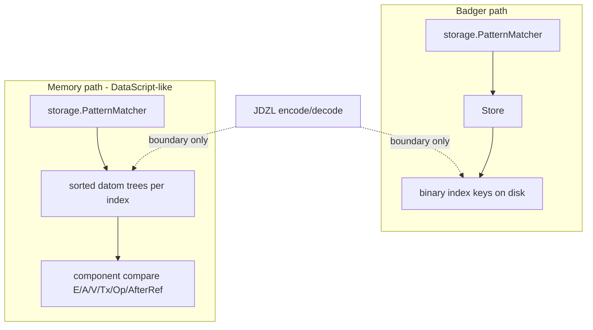

# Memory indexes: DataScript trees, not Badger keys in RAM

## Status

Proposal. Motivated by the wasm / injectable-`Store` work (`MemoryStore` today) and the realization that mirroring Badger’s binary key layout in process memory is the wrong representation for an in-memory engine.

## Summary

Reject Badger binary keys as the live in-memory representation. Memory follows DataScript: sorted trees of typed datoms per index order, with seek/slice by component compare. Binary encoding stays at the Badger and JDZL boundaries only. `storage.PatternMatcher` (renamed from `BadgerMatcher`) owns index selection against that abstraction; physical scan forks by backend.

## The mistake in the current MemoryStore

Today [`MemoryStore`](../../datalog/storage/memory_store.go) stores **the same binary keys Badger uses on disk**, then adds a sorted `[]string` so prefix seek is not O(N). Every assert/retract/scan pays `BinaryKeyEncoder` / `DatomFromKey` in a process that has no disk and no Badger.

That is backwards for an in-memory engine. Encoding exists to make **byte order on disk** match index order. In RAM you already have typed values — compare them directly.

## How DataScript does it

DataScript’s DB is not a KV map of encoded keys. It is:

- A set of **datoms** (typed records)
- **Several sorted indexes** — historically EAVT / AEVT / AVET as persistent B+ trees (`btset`), same datoms, different sort orders
- Lookups via **`datoms` / `seek-datoms` / `slice`**: build a from/to datom bound, walk the tree in index order
- Hot path: **component compare**, not serialize-then-`bytes.Compare`

Architecture notes (tonsky / datascript-tutorial): the indexes *are* the store; there is no side table of “real” datoms behind them. Range scans are the product.

Janus is richer than DataScript (CRDT Op/AfterRef, more index orders, ElementID Tx, History/AsOf), but the **representation principle** is the same: **trees of datoms, sorted by index comparator**.

## Target model for MemoryStore

**Primary representation:** for each index order Janus needs for matching (at least the ones `PatternMatcher` selects today — EAVT, EATV, AEVT, AETV, ATEV, AVET, VAET, TAEV as required), a **sorted tree (or sorted slice + binary search for v1) of `datalog.Datom`**, ordered by that index’s component comparator.

- **Assert:** insert the same datom into each index tree (DataScript does this; cost is pointer/struct sharing, not 8× encoded key blobs).
- **Retract:** seek EAVT (or E+A+V bound) by component compare, remove matching datoms from all trees.
- **Scan for the matcher:** seek low-bound datom → iterate while `<` high bound — **no `EncodeKey` / `DatomFromKey`**.
- **Blobs / large values:** keep values as Go values in the datom (or a side content-addressed blob map keyed by hash **as a value store**, not as fake index keys). Tier-3 is a Badger packing concern; memory can hold the bytes or the decoded value without pretending they are index keys.

**What we stop doing in MemoryStore:**

- `map[string][]byte` of Badger keys
- Sorted parallel `keys []string` of those encodings
- Hot-path round-trips through `BinaryKeyEncoder`

## PatternMatcher (rename + scan split)

Renaming `BadgerMatcher` → `storage.PatternMatcher` is correct: index *selection* is store-agnostic. The type already takes `Store` and serves Badger or Memory; the Badger prefix is leftover fiction.

What changes is the **physical scan**:

| Backend | Physical seek |
|---------|----------------|
| Badger | `Store.ScanKeysOnly` + binary prefixes (unchanged) |
| Memory | datom-tree seek/slice by bound components |

So either:

1. **`PatternMatcher` depends on a small scan interface** with two adapters (`binaryStoreScan` vs `datomTreeScan`), or
2. **Memory does not implement full `Store`**; `Database` wires Memory to a tree-backed scan used only by `PatternMatcher`, while Badger keeps `Store`.

Prefer (1) or a narrow “index cursor” API so one matcher owns planning. Do **not** keep implementing `Store` on Memory by secretly encoding keys — that recreates the bug.

Name coexistence:

- `executor.PatternMatcher` — the interface
- `storage.PatternMatcher` — the Store-/tree-backed concrete matcher
- `executor.NewMemoryPatternMatcher` — unrelated slice + hash-index helper for multi-source tests; do not conflate with `MemoryStore`

## Store / Database / JDZL boundaries

- **`Store`:** remains the Badger-shaped persistence API (binary keys). Memory is not obligated to fake it.
- **`Database`:** opens either Badger `Store` or Memory datom-indexes; matcher construction picks the scan backend.
- **JDZL / EDN export:** walk Memory’s EAVT **datom** tree and encode at the writer; import decodes into tree inserts. Encoding is a **serialization boundary**, not the live representation.
- **Backend contract tests:** parity of *query/export semantics*, not byte-identical internal keys between Memory and Badger.

## Comparators (Janus-specific)

Each index needs a total order on `datalog.Datom` matching today’s binary key order (so Badger and Memory agree on scan results):

- Identity / attribute / value / ElementID / Op / AfterRef as in `BinaryKeyEncoder` layouts
- Document that binary encoding and datom compare are two projections of the same order (tests: same sorted sequence for a fixture under both)

## What we are abandoning

- “Collapse map+keys into one ordered **string-key** map” — still the wrong domain (encoded keys).
- “MemoryStore mirrors Badger’s eight binary projections in RAM” as the long-term design.

## Implementation sketch (not scheduled here)

1. Define per-index datom comparators that match binary key order; lock with differential tests against `EncodeKey` sort order.
2. Replace MemoryStore’s KV map with datom trees (v1: sorted slices + binary search is acceptable).
3. Introduce a narrow scan/cursor abstraction; adapt Badger `Store` and Memory trees.
4. Rename `BadgerMatcher` → `storage.PatternMatcher` and wire scan backends.
5. Point JDZL Memory export/import at the EAVT datom tree.
6. Keep backend contracts on semantic parity; drop any expectation of shared internal key bytes.

## Decisions and survey notes (2026-07-18)

Recorded so implementation can start without re-baselining. File:line references are point-in-time as of this date; verify before acting on them.

This project is the prerequisite for the implementation plan in [TRANSACTION_ENVELOPES.md](TRANSACTION_ENVELOPES.md): the envelope work's typed `TransactionRecord` trees reuse the tree-and-comparator machinery built here, and its visibility PR threads through the renamed `storage.PatternMatcher`, so both land after this project to avoid double churn.

### Decision of record: Identity becomes hash-only (first PR of this project)

`datalog.identity` currently carries `{value [20]byte, str string}` where `str` is the in-process seed string, never persisted. The defect: the intern cache is keyed by hash and `LoadOrStore` means whichever constructor touches an entity first wins the pointer — `NewIdentity("alice")` before a storage decode renders `"alice"` everywhere; decode first renders L85 forever, in the same process. `String()` output is provenance- and order-dependent, and every seed is pinned in the intern cache for process lifetime. The fix: delete `str`; `NewIdentity` hashes and discards the seed; `String()` always returns `L85()`. `identity` becomes a bare interned 20-byte content address — exactly the storage projection the comparators below compare.

String↔Identity match coercion is **removed, not preserved** (decided 2026-07-18):

- `executor/pattern_match.go:128` (`matchesConstant`) and `executor/constraints_impl.go:235` drop their `v.String() == c` special cases and fall through to generic typed comparison. A string constant against an Identity-valued position is an ordinary typed non-match (`ValuesEqual` on cross-type pairs within the domain is `false`, not a panic) — same semantics as a string constant against an `int64` value.
- `storage/matcher.go:616` (E-position fallback `fmt.Sprintf("%v", e)` compare) becomes a **loud validation error** for non-Identity E-position bindings, not a silent no-match. E-position is inhabited only by `Identity`; a string constant there is a query defect, and silent empty results are the latent-default failure mode.
- The rule for any further site found during implementation: boundary *construction* (`NewIdentity`, `#identity "L85"`, APIs that explicitly mint an Identity from a string at the edge) is legitimate; comparison-time *coercion* (string-comparing an already-flowing value across the type boundary) is banned.

Survey results backing the change (2026-07-18):

- Persistence is already canonical; the change is fully data-compatible. EDN export renders entities via `L85()` explicitly (`storage/export.go:256`, `IdentityNode`, used for E-position and value-position refs); import decodes L85 → `NewIdentityFromHash`. JDZL writes raw hash bytes (`export_bin.go:495`, decode `:567`). `cmd/datalog -stats` uses `L85()`/`Hash()` (`stats.go:114,211`).
- `query/types.go:20` (`FormatValueEDN`) currently emits `#identity "<seed>"` for in-process identities — text the `#identity` reader decodes as L85 into the wrong hash. The change fixes this live bug.
- The reflect package is unaffected semantically: identity struct fields round-trip as `Identity` values by direct assignment on both paths; its only `String()` calls feed annotation events (`reflect/writer.go:117,168,184,236`).
- Pull results and `ExecuteRealized` tuples carry `Identity` values; string rendering happens only at display boundaries (`executor/table_formatter.go:114`, parser query pretty-printer `parser/parser.go:1586`). Those switch seed → L85.
- ~20 production `String()` calls are annotation/debug formatting only (`executor/pull_context.go` cluster, `storage/matcher_relations.go:682,867,921,943`). `datalog/compare.go:435` (`stringValue` Identity branch) is effectively dead: Identity-vs-Identity ordering is handled by hash at `compare.go:96`; `compareByRank` only runs for different-rank pairs.
- Direct `str` field accesses exist only in `datalog/identity.go` itself (write `:57`, reads `:93-94`).
- Scope beyond code: rewrite tests that match entities by seed string (`tests/identity_input_matching_bug_test.go` and clusters in `storage`, `parser/format_test.go`, `executor`, `datalog/types_test.go`) to use `#identity` literals or `:in` inputs; sweep docs for match-by-name-string claims (DATOMIC_COMPATIBILITY.md, datalog skill reference, examples).
- Versioning: data-compatible, `String()` signature unchanged, quiet display-output change — lands in the current v0.x patch series with a changelog note for anyone printing entity names instead of storing them as attributes.

### Survey: current MemoryStore baseline

`storage/memory_store.go`: `map[string][]byte` entries keyed by encoded index key plus a `*btree.BTreeG[string]` of key strings for ordered seeks (`:36-59`); `memoryStoreTx` journals prior values for rollback (`:301-373`); `assertMemoryDatom` mirrors Badger's blob handling — blob entry then eight index keys in one tx (`:435-447`); `MaxElementID` scans the TAEV prefix (`:165-175`). Backend selection: `openDefaultStore` returns Badger on native (`default_store_native.go`) and MemoryStore on js/wasm (`default_store_wasm.go`) — **MemoryStore is the wasm build's only backend**, so this project directly changes the wasm engine's hot path and is what the DataScript-shaped JS API work inherits.

### Survey: Store consumers beyond matcher scans

The scan-abstraction decision ripples further than pattern matching. Non-matcher Store consumers that need memory-tree answers (all non-test, surveyed 2026-07-18): the commit path (`database.go:2165` `BeginTx`/`StoreTx.Assert`), EDN import (`export.go:158,171` `Store.Assert`; `:179` `MaxElementID`), JDZL import (`export_bin.go:247,263`), truncate (`truncate.go:70` `DatomsAfter`, `:80` `DeleteDatoms`), snapshots (`snapshot.go:243` `MaxTxForEntity`), clock restore (`database.go:194` `MaxElementID`), replica-id metadata (`database.go:166,183` `GetMetadataUint64`/`SetMetadataUint64`), and the blob store. Option 2 in the scan-split section ("Memory does not implement full Store") would touch every one of these call sites; option 1 keeps them behind the existing `Store` methods.

### Design note: comparators compare storage projections, not user-facing values

Binary key order is defined over the storage projections: E as the 20-byte identity hash (never the seed string — trivially true once Identity is hash-only), A as the fixed 32-byte attribute form (where truncation can diverge from Go string compare; see `attribute_truncation_collision_test.go`), V as type-tag-then-sort-preserving-bytes, and Tx **descending** in the Tx↓ indexes. Per the CRDT model, index ordering *is* the resolution: any edge case where the typed comparator disagrees with binary order makes Memory and Badger silently resolve the same datom set differently. The differential tests in sketch step 1 (same fixture, identical sort under `EncodeKey` bytes and under the typed comparator) are the single most load-bearing deliverable in this project.

### Design note: concurrency model must be decided before trees are built

This document is silent on concurrency, and the choice shapes step 2. Badger gives readers MVCC snapshots during commits; the current `memoryStoreTx` journals prior values for rollback. With typed trees the options are: persistent/copy-on-write trees (commit is a pointer swap — atomicity and O(1) rollback for free, readers keep a consistent snapshot during concurrent commits) versus mutable trees plus locking (queries block on writes or race). `Database` allows concurrent queries during commits, so this is a semantic decision, not an optimization.

### Design note: bulk load

v1 sorted slices mean O(N) memmove per insert per index. Bulk JDZL import into a memory database (the wasm path; millions of datoms at production scale) should sort-then-build rather than insert per datom, even in v1.

### Staging (one establishment per PR)

1. **PR 0 — hash-only Identity** (decision above). Small, standalone, data-compatible; every tree and comparator built afterward inherits the canonical representation.
2. **PR A — rename + scan seam.** `BadgerMatcher` → `storage.PatternMatcher` plus the narrow scan/cursor interface with the Badger adapter as its sole consumer. Zero behavior change; establishes the seam against the existing backend and kills the leftover-fiction name.
3. **PR B — the swap.** Comparators + differential ordering tests, typed datom trees, the memory scan adapter, JDZL/EDN boundary encode-at-writer, and semantic-parity backend contracts, as one unit — no subset leaves the memory backend coherent. Comparators land here, with their consumer, not as an unconsumed PR of definitions.

### Open questions to ratify at kickoff

- Scan abstraction: option 1 (narrow scan interface, matcher owns planning — preferred above) vs option 2 (Memory does not implement full `Store`). See the consumer survey: option 2's real surface is much larger than matcher scans.
- Tree representation: persistent/COW vs mutable-plus-locks — effectively the concurrency decision.
- All eight index orders as trees, or only those the matcher selects against memory today.
