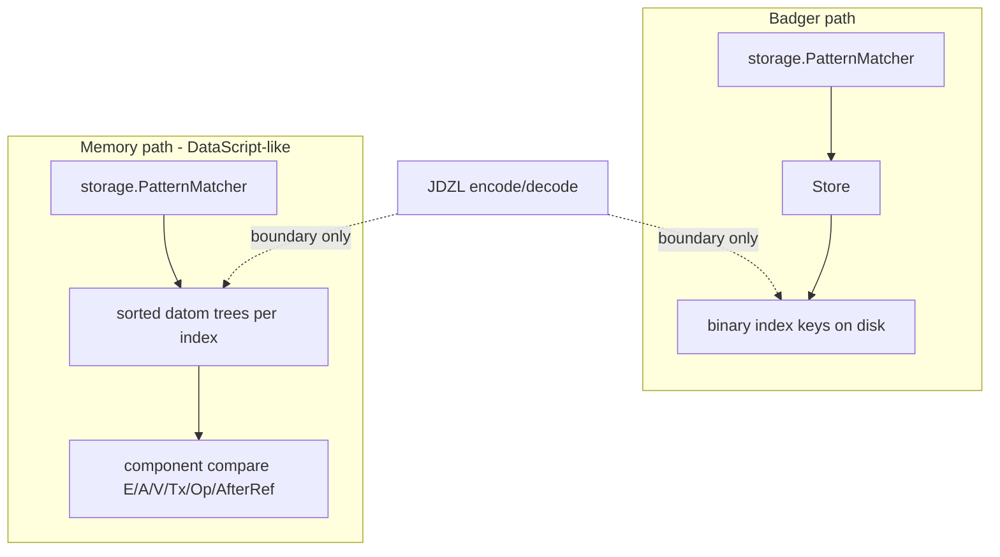

# Memory indexes: DataScript trees, not Badger keys in RAM

## Status

Proposal. Motivated by the wasm / injectable-`Store` work (`MemoryStore` today) and the realization that mirroring Badger’s binary key layout in process memory is the wrong representation for an in-memory engine.

Kickoff questions ruled 2026-07-25; see *Decisions of record (2026-07-25)*. PR 0 (hash-only `Identity`) verified already satisfied. **PR A landed** — the read seam speaks typed `ScanBound`s — with its departures from Ruling 1's scope recorded under *What landed (PR A)*. PR B, the representation swap, is queued and not started.

## Summary

Reject Badger binary keys as the live in-memory representation. Memory follows DataScript: sorted trees of typed datoms per index order, with seek/slice by component compare. Binary encoding stays at the Badger and JDZL boundaries only. `storage.PatternMatcher` (renamed from `BadgerMatcher`) owns index selection against that abstraction; physical scan forks by backend.

## The mistake in the current MemoryStore

Today [`MemoryStore`](../../datalog/storage/memory_store.go) stores **the same binary keys Badger uses on disk**, then adds a sorted `[]string` so prefix seek is not O(N). Every assert/retract/scan pays `BinaryKeyEncoder` / `DatomFromKey` in a process that has no disk and no Badger.

That is backwards for an in-memory engine. Encoding exists to make **byte order on disk** match index order. In RAM you already have typed values — compare them directly.

## How DataScript does it

DataScript’s DB is not a KV map of encoded keys. It is:

- A set of **datoms** (typed records)
- **Several sorted indexes** — historically EAVT / AEVT / AVET as persistent B+ trees (`btset`), same datoms, different sort orders
- Lookups via **`datoms` / `seek-datoms` / `slice`**: build a from/to datom bound, walk the tree in index order
- Hot path: **component compare**, not serialize-then-`bytes.Compare`

Architecture notes (tonsky / datascript-tutorial): the indexes *are* the store; there is no side table of “real” datoms behind them. Range scans are the product.

Janus is richer than DataScript (CRDT Op/AfterRef, more index orders, ElementID Tx, History/AsOf), but the **representation principle** is the same: **trees of datoms, sorted by index comparator**.



## Target model for MemoryStore

**Primary representation:** for each index order Janus needs for matching (at least the ones `PatternMatcher` selects today — EAVT, EATV, AEVT, AETV, ATEV, AVET, VAET, TAEV as required), a **sorted tree (or sorted slice + binary search for v1) of `datalog.Datom`**, ordered by that index’s component comparator.

- **Assert:** insert the same datom into each index tree (DataScript does this; cost is pointer/struct sharing, not 8× encoded key blobs).
- **Retract:** seek EAVT (or E+A+V bound) by component compare, remove matching datoms from all trees.
- **Scan for the matcher:** seek low-bound datom → iterate while `<` high bound — **no `EncodeKey` / `DatomFromKey`**.
- **Blobs / large values:** keep values as Go values in the datom (or a side content-addressed blob map keyed by hash **as a value store**, not as fake index keys). Tier-3 is a Badger packing concern; memory can hold the bytes or the decoded value without pretending they are index keys.

**What we stop doing in MemoryStore:**

- `map[string][]byte` of Badger keys
- Sorted parallel `keys []string` of those encodings
- Hot-path round-trips through `BinaryKeyEncoder`

## PatternMatcher (rename + scan split)

Renaming `BadgerMatcher` → `storage.PatternMatcher` is correct: index *selection* is store-agnostic. The type already takes `Store` and serves Badger or Memory; the Badger prefix is leftover fiction.

What changes is the **physical scan**:

| Backend | Physical seek |
|---------|----------------|
| Badger | `Store.ScanKeysOnly` + binary prefixes (unchanged) |
| Memory | datom-tree seek/slice by bound components |

So either:

1. **`PatternMatcher` depends on a small scan interface** with two adapters (`binaryStoreScan` vs `datomTreeScan`), or
2. **Memory does not implement full `Store`**; `Database` wires Memory to a tree-backed scan used only by `PatternMatcher`, while Badger keeps `Store`.

Prefer (1) or a narrow “index cursor” API so one matcher owns planning. Do **not** keep implementing `Store` on Memory by secretly encoding keys — that recreates the bug.

Name coexistence:

- `executor.PatternMatcher` — the interface
- `storage.PatternMatcher` — the Store-/tree-backed concrete matcher
- `executor.NewMemoryPatternMatcher` — unrelated slice + hash-index helper for multi-source tests; do not conflate with `MemoryStore`

## Store / Database / JDZL boundaries

- **`Store`:** remains the Badger-shaped persistence API (binary keys). Memory is not obligated to fake it.
- **`Database`:** opens either Badger `Store` or Memory datom-indexes; matcher construction picks the scan backend.
- **JDZL / EDN export:** walk Memory’s EAVT **datom** tree and encode at the writer; import decodes into tree inserts. Encoding is a **serialization boundary**, not the live representation.
- **Backend contract tests:** parity of *query/export semantics*, not byte-identical internal keys between Memory and Badger.

## Comparators (Janus-specific)

Each index needs a total order on `datalog.Datom` matching today’s binary key order (so Badger and Memory agree on scan results):

- Identity / attribute / value / ElementID / Op / AfterRef as in `BinaryKeyEncoder` layouts
- Document that binary encoding and datom compare are two projections of the same order (tests: same sorted sequence for a fixture under both)

## What we are abandoning

- “Collapse map+keys into one ordered **string-key** map” — still the wrong domain (encoded keys).
- “MemoryStore mirrors Badger’s eight binary projections in RAM” as the long-term design.

## Implementation sketch (not scheduled here)

1. Define per-index datom comparators that match binary key order; lock with differential tests against `EncodeKey` sort order.
2. Replace MemoryStore’s KV map with datom trees (v1: sorted slices + binary search is acceptable).
3. Introduce a narrow scan/cursor abstraction; adapt Badger `Store` and Memory trees.
4. Rename `BadgerMatcher` → `storage.PatternMatcher` and wire scan backends.
5. Point JDZL Memory export/import at the EAVT datom tree.
6. Keep backend contracts on semantic parity; drop any expectation of shared internal key bytes.

## Decisions and survey notes (2026-07-18)

Recorded so implementation can start without re-baselining. File:line references are point-in-time as of this date; verify before acting on them.

This project is the prerequisite for the implementation plan in [TRANSACTION_ENVELOPES.md](TRANSACTION_ENVELOPES.md): the envelope work's typed `TransactionRecord` trees reuse the tree-and-comparator machinery built here, and its visibility PR threads through the renamed `storage.PatternMatcher`, so both land after this project to avoid double churn.

### Decision of record: Identity becomes hash-only (first PR of this project)

**SATISFIED — verified against the tree 2026-07-25.** The decision below is implemented; PR 0 is behind the project rather than ahead of it.

Landed state:

- `datalog/identity.go:29-31` — `identity` is `struct { value [20]byte }`. The `str` field is gone.
- `datalog/identity.go:40-54` — `NewIdentity` hashes the seed and discards it.
- `datalog/identity.go:85-87` — `String()` returns `L85()`.
- `datalog/executor/pattern_match.go:130-144` — `matchesConstant` matches Identity only against Identity and Keyword only against Keyword; the boundary-construction rule is stated in the code comments.
- `datalog/executor/constraints_impl.go` — file deleted (`DECISION_LEDGER.md` item 12, 2026-07-20), so its coercion site is gone with it.
- `datalog/storage/matcher.go:582-609` — the E-position `fmt.Sprintf("%v", e)` fallback is replaced by a loud panic naming `validateEntityBinding` as the upstream validator. The attribute position received the same treatment against `validateAttributeBinding`.
- `datalog/query/types.go:19-20` — `FormatValueEDN` emits `#identity "<L85>"`, closing the round-trip defect the decision identified.

Tests converted to the canonical representation: `datalog/types_test.go:32` (datom renders entity as L85), `:91` (`String() == L85()`), `:122` (an identity built from a hash does not know its seed); `datalog/parser/format_test.go:142` (expected output computed from `L85()`); `tests/identity_input_matching_bug_test.go` (entities passed as `:in` parameters, compared by `Equal`).

`datalog.identity` currently carries `{value [20]byte, str string}` where `str` is the in-process seed string, never persisted. The defect: the intern cache is keyed by hash and `LoadOrStore` means whichever constructor touches an entity first wins the pointer — `NewIdentity("alice")` before a storage decode renders `"alice"` everywhere; decode first renders L85 forever, in the same process. `String()` output is provenance- and order-dependent, and every seed is pinned in the intern cache for process lifetime. The fix: delete `str`; `NewIdentity` hashes and discards the seed; `String()` always returns `L85()`. `identity` becomes a bare interned 20-byte content address — exactly the storage projection the comparators below compare.

String↔Identity match coercion is **removed, not preserved** (decided 2026-07-18):

- `executor/pattern_match.go:128` (`matchesConstant`) and `executor/constraints_impl.go:235` drop their `v.String() == c` special cases and fall through to generic typed comparison. A string constant against an Identity-valued position is an ordinary typed non-match (`ValuesEqual` on cross-type pairs within the domain is `false`, not a panic) — same semantics as a string constant against an `int64` value.
- `storage/matcher.go:616` (E-position fallback `fmt.Sprintf("%v", e)` compare) becomes a **loud validation error** for non-Identity E-position bindings, not a silent no-match. E-position is inhabited only by `Identity`; a string constant there is a query defect, and silent empty results are the latent-default failure mode.
- The rule for any further site found during implementation: boundary *construction* (`NewIdentity`, `#identity "L85"`, APIs that explicitly mint an Identity from a string at the edge) is legitimate; comparison-time *coercion* (string-comparing an already-flowing value across the type boundary) is banned.

Survey results backing the change (2026-07-18):

- Persistence is already canonical; the change is fully data-compatible. EDN export renders entities via `L85()` explicitly (`storage/export.go:256`, `IdentityNode`, used for E-position and value-position refs); import decodes L85 → `NewIdentityFromHash`. JDZL writes raw hash bytes (`export_bin.go:495`, decode `:567`). `cmd/datalog -stats` uses `L85()`/`Hash()` (`stats.go:114,211`).
- `query/types.go:20` (`FormatValueEDN`) currently emits `#identity "<seed>"` for in-process identities — text the `#identity` reader decodes as L85 into the wrong hash. The change fixes this live bug.
- The reflect package is unaffected semantically: identity struct fields round-trip as `Identity` values by direct assignment on both paths; its only `String()` calls feed annotation events (`reflect/writer.go:117,168,184,236`).
- Pull results and `ExecuteRealized` tuples carry `Identity` values; string rendering happens only at display boundaries (`executor/table_formatter.go:114`, parser query pretty-printer `parser/parser.go:1586`). Those switch seed → L85.
- ~20 production `String()` calls are annotation/debug formatting only (`executor/pull_context.go` cluster, `storage/matcher_relations.go:682,867,921,943`). `datalog/compare.go:435` (`stringValue` Identity branch) is effectively dead: Identity-vs-Identity ordering is handled by hash at `compare.go:96`; `compareByRank` only runs for different-rank pairs.
- Direct `str` field accesses exist only in `datalog/identity.go` itself (write `:57`, reads `:93-94`).
- Scope beyond code: rewrite tests that match entities by seed string (`tests/identity_input_matching_bug_test.go` and clusters in `storage`, `parser/format_test.go`, `executor`, `datalog/types_test.go`) to use `#identity` literals or `:in` inputs; sweep docs for match-by-name-string claims (DATOMIC_COMPATIBILITY.md, datalog skill reference, examples).
- Versioning: data-compatible, `String()` signature unchanged, quiet display-output change — lands in the current v0.x patch series with a changelog note for anyone printing entity names instead of storing them as attributes.

### Survey: current MemoryStore baseline

`storage/memory_store.go`: `map[string][]byte` entries keyed by encoded index key plus a `*btree.BTreeG[string]` of key strings for ordered seeks (`:36-59`); `memoryStoreTx` journals prior values for rollback (`:301-373`); `assertMemoryDatom` mirrors Badger's blob handling — blob entry then eight index keys in one tx (`:435-447`); `MaxElementID` scans the TAEV prefix (`:165-175`). Backend selection: `openDefaultStore` returns Badger on native (`default_store_native.go`) and MemoryStore on js/wasm (`default_store_wasm.go`) — **MemoryStore is the wasm build's only backend**, so this project directly changes the wasm engine's hot path and is what the DataScript-shaped JS API work inherits.

### Survey: Store consumers beyond matcher scans

The scan-abstraction decision ripples further than pattern matching. Non-matcher Store consumers that need memory-tree answers (all non-test, surveyed 2026-07-18): the commit path (`database.go:2165` `BeginTx`/`StoreTx.Assert`), EDN import (`export.go:158,171` `Store.Assert`; `:179` `MaxElementID`), JDZL import (`export_bin.go:247,263`), truncate (`truncate.go:70` `DatomsAfter`, `:80` `DeleteDatoms`), snapshots (`snapshot.go:243` `MaxTxForEntity`), clock restore (`database.go:194` `MaxElementID`), replica-id metadata (`database.go:166,183` `GetMetadataUint64`/`SetMetadataUint64`), and the blob store. Option 2 in the scan-split section ("Memory does not implement full Store") would touch every one of these call sites; option 1 keeps them behind the existing `Store` methods.

### Design note: comparators compare storage projections, not user-facing values

Binary key order is defined over the storage projections: E as the 20-byte identity hash (never the seed string — trivially true once Identity is hash-only), A as the fixed 32-byte attribute form (where truncation can diverge from Go string compare; see `attribute_truncation_collision_test.go`), V as type-tag-then-sort-preserving-bytes, and Tx **descending** in the Tx↓ indexes. Per the CRDT model, index ordering *is* the resolution: any edge case where the typed comparator disagrees with binary order makes Memory and Badger silently resolve the same datom set differently. The differential tests in sketch step 1 (same fixture, identical sort under `EncodeKey` bytes and under the typed comparator) are the single most load-bearing deliverable in this project.

### Design note: concurrency model must be decided before trees are built

This document is silent on concurrency, and the choice shapes step 2. Badger gives readers MVCC snapshots during commits; the current `memoryStoreTx` journals prior values for rollback. With typed trees the options are: persistent/copy-on-write trees (commit is a pointer swap — atomicity and O(1) rollback for free, readers keep a consistent snapshot during concurrent commits) versus mutable trees plus locking (queries block on writes or race). `Database` allows concurrent queries during commits, so this is a semantic decision, not an optimization.

RULED 2026-07-25: persistent (Ruling 2 below). The choice is not open. `Store.NewReadSession`'s snapshot contract, which postdates this note, admits no mutable-plus-locks implementation that is neither a writer blocked for a query's lifetime nor an O(N) copy at session open.

### Design note: bulk load

v1 sorted slices mean O(N) memmove per insert per index. Bulk JDZL import into a memory database (the wasm path; millions of datoms at production scale) should sort-then-build rather than insert per datom, even in v1.

### Staging (one establishment per PR)

1. **PR 0 — hash-only Identity** — **SATISFIED** (verified 2026-07-25). Data-compatible; every tree and comparator built afterward inherits the canonical representation. Landed state and evidence under *Decision of record: Identity becomes hash-only* above.
2. **PR A — rename + typed-bound seam.** `BadgerMatcher` → `storage.PatternMatcher`, and `StoreReader`'s scan/seek/get surface converts from binary key ranges to typed datom bounds, with the Badger adapter encoding at its own boundary as the sole consumer (Ruling 1). `Encoder()` leaves the store-agnostic interface in the same change. *Amended 2026-07-25*: this is no longer a rename with zero behavior change. The seam already exists as `StoreReader`; what this PR establishes is its vocabulary. Query results are unchanged; the interface is not.
3. **PR B — the swap.** One declarative specification of each index's component order with encoder and comparator as derived projections, differential ordering tests as its proof, persistent typed datom trees for all eight orders, the memory scan adapter, JDZL/EDN boundary encode-at-writer, and semantic-parity backend contracts, as one unit — no subset leaves the memory backend coherent. The specification and its projections land here, with their consumer, not as an unconsumed PR of definitions. *Amended 2026-07-25*: the `memoryEntryUndo` journal and the vestigial per-scan key copy are deleted by this PR, not ported (Ruling 2).

### Open questions to ratify at kickoff — all RULED 2026-07-25

Questions retained with their rulings; grounds in *Decisions of record (2026-07-25)* below.

- Scan abstraction: option 1 (narrow scan interface, matcher owns planning — preferred above) vs option 2 (Memory does not implement full `Store`). See the consumer survey: option 2's real surface is much larger than matcher scans. — **RULED: option 1, with the seam's vocabulary converted to typed datom bounds (Ruling 1).**
- Tree representation: persistent/COW vs mutable-plus-locks — effectively the concurrency decision. — **RULED: persistent; a database version is a root pointer (Ruling 2).**
- All eight index orders as trees, or only those the matcher selects against memory today. — **RULED: all eight, generated from one specification with encoder and comparator as derived projections (Ruling 3).**

## Decisions of record (2026-07-25)

All three kickoff questions are ruled. Grounds are recorded because two of them turn on invariants that postdate the 2026-07-18 survey.

### Survey refresh (2026-07-25)

Three point-in-time corrections to the notes above.

- **`StoreReader` / `ReadSession` exist** (`datalog/storage/read_session.go`). `StoreReader` is the read subset of `Store` — as surveyed, `Encoder`, `Scan`, `ScanKeysOnly`, `Get`, `MaxElementID`, `MaxElementIDForAttribute`, `MaxTxForEntity` — satisfied by both a `Store` (each call opens its own storage transaction) and a `ReadSession` (every call observes one snapshot), with read paths already written against it. The narrow read seam this document asks for is in the tree. What it lacks is a store-agnostic vocabulary. *(PR A supplied exactly that and shortened the set: `Scan`/`ScanKeysOnly` take a typed `ScanBound`, and `Encoder`, `Get` and `MaxElementIDForAttribute` are gone. See* What landed (PR A) *below.)*
- **`Store.NewReadSession` carries a snapshot contract**: every read through a session observes one state regardless of writes committed after it opened, so a query can never observe two database states mid-execution. `MemoryStore` honors it with an O(1) copy-on-write clone of the key B-tree (`read_session_memory.go`), taken under the write lock.
- **`memoryReadSession.scan` still materializes.** It collects every key in range into a fresh `[][]byte` before returning its iterator, although the clone already isolates the walk from concurrent writes. The copy is vestigial under the session design and must not be carried into the tree backend.

### Ruling 1 — the seam speaks typed datom bounds; `Encoder()` leaves it

`StoreReader` converts from binary key ranges to an index order plus typed low/high bounds expressed as partial datoms. Badger's adapter encodes those bounds to prefixes at its own boundary; the memory trees compare components directly. `Encoder() *BinaryKeyEncoder` comes off the store-agnostic interface — it is a Badger concern, and its presence on a shared surface is the mechanism by which a typed backend would be forced to secretly encode, the failure named in *PatternMatcher (rename + scan split)* above.

Option 2 is rejected. The read seam is not the defect; it exists and both backends satisfy it. Option 2 changes which types implement the interface without changing the interface's vocabulary, which is the defect.

Scope. The conversion is not confined to the scan methods:

- `Iterator.Seek(key []byte)` becomes a seek to a typed bound, or the byte vocabulary survives in the cursor and the seam is half-converted.
- `Get(index, key []byte)`, a point lookup by *full* index key, is set membership on a complete datom; its `index` parameter is vestigial under the typed form.
- `maxElementIDForAttributeByScan` and `maxTxForEntityByScan` currently express semantic bounds through the `EncodePrefixRange` idiom. Under typed bounds they state the bound directly and the encoder call disappears.

The write surface already speaks typed datoms (`Assert([]datalog.Datom)`). Only reads were encoded; the asymmetry has nothing behind it.

#### What landed (PR A, 2026-07-25)

Three departures from the scope list above, recorded here because the list is what the next reader will check against.

- **`Get` was removed, not converted.** The typed form made the question vanish rather than restate it: a complete index key names one `(E, A, V, Tx)`, but Tx is what CRDT resolution *determines*, so a reader that already knew it had nothing left to ask. Every read is a scan; a bound binding all four components is the point lookup, and returns at most one datom because Tx is unique per operation. `Store.Get` and `StoreReader.Get` are both gone.
- **`maxElementIDForAttributeByScan` was deleted, not converted.** It served the per-attribute cache-freshness shortcut, which was removed in the same arc. ATEV stays for its AsOf-by-attribute seeks; `maxTxForEntityByScan` converted as described.
- **A `ScanBound` is an equality constraint on leading components and nothing else.** An intermediate revision of this PR carried an optional `Through`, so a bound could span from one prefix to another for two batch-scan sites that covered a set of per-binding prefixes in one pass. Both of those sites are gone — the iterator-reuse strategy and the batch scanner were deleted during review, the former having been default-off since 2025-10 on a benchmark that does not survive inspection — and `Through` went with them. The bound that shipped binds the leading components of an index's order to values, and names the datoms whose components equal them.

**The seam's contract is logical, and narrowing is the backend's obligation.** This is the part a second backend must reproduce, and the part an implementer will not infer from the type. A scan yields *exactly* the datoms whose bound components equal the bound's values. For a backend that projects onto byte keys that is not free: a V payload carries no length, so the keys for `"abcd"` sort inside the range for `"abc"` interleaved with them, and no choice of endpoints separates the two. What separates them is length — every component behind V is fixed width and `Op` announces `AfterRef`, so a key carrying the bound's own value has exactly one length per `Op` class.

`EncodeScanBound` therefore returns an `EncodedRun`: the byte range, plus a `runMembership` deciding which keys inside it the bound names. Both in-tree stores apply it — `KeyOnlyIterator` and `memoryIterator` each hold the membership and consult it from `Next`, `Key` and `Datom`. **A tree-backed backend comparing typed components directly has no such gap and needs no membership test** — which is precisely why the obligation has to be stated as a contract rather than left implicit in the byte encoder. A backend that returns everything inside a range returns datoms the caller did not ask for, and no test above this seam will say so.

The set-of-prefixes shape — a bound carrying N prefixes, leaving the store to choose between spanning-and-filtering and issuing N seeks — remains **not** taken. Whether an ordered-range predicate belongs alongside the equality bound is open and pending the owner; `TestTimeBasedQueries`' Tx range on TAEV was `Through`'s one correct use, and a caller wanting a range now seeks and walks with its own stop condition, as `pull_batch.go` does.

### Ruling 2 — persistent trees; a database version is a value and the store is a pointer to it

Trees are persistent — structurally shared and immutable. Commit is a root-pointer swap, a read session is a retained root, and a database version *is* a root.

This is forced rather than preferred. The `NewReadSession` contract admits exactly three implementations under mutable-plus-locks: hold a read lock for the session's lifetime, which blocks writers for arbitrary query durations and contradicts the concurrency `Database` allows; copy at session open, which is O(N) per query; or fail to honor a guarantee the interface documents. `MemoryStore` already reaches for the COW clone for this reason.

Consequences beyond concurrency:

- The `memoryEntryUndo` journal (`memory_store.go`) is deleted rather than ported. Rollback is discarding a root.
- The vestigial per-scan key copy disappears: a cursor over a retained immutable root needs neither lock nor copy, which is also what the streaming invariant requires of a scan.
- Fixed-basis temporal reads become root retention rather than a per-read Tx comparison. This changes the cost profile of [TRANSACTION_ENVELOPES.md](TRANSACTION_ENVELOPES.md) PR 4 (transaction-closed AsOf), whose PR sequence does not yet account for it.
- Branching and snapshots ([BRANCHING_AND_SNAPSHOTS.md](BRANCHING_AND_SNAPSHOTS.md)) become the same mechanism rather than a separate one.

Cost: persistent trees pay path copying per insert. That resolves with the bulk-load note rather than against it — a transient mutable builder that freezes into an immutable tree, so import sorts and builds once instead of inserting per datom.

### Ruling 3 — all eight orders, generated from one specification

All eight index orders become trees. Encoder and comparator are both derived projections of a single declarative specification of each index's component order; the differential ordering tests are the proof, not the only link holding the two projections together.

Grounds, in order of force:

1. Index ordering *is* the CRDT resolution. EATV/AETV first-entry-wins, ATEV's attribute high-water mark, and TAEV's descending clock recovery are definitions, not access-path optimizations. Dropping an order means losing a resolution path or re-implementing it by buffering.
2. Non-matcher consumers pin orders regardless of matcher selection: TAEV (`MaxElementID`, `DatomsAfter`), ATEV (the attribute high-water mark), EAVT (`MaxTxForEntity`, `ExportBinary`, the retract search prefix). "Only those the matcher selects" was never the full requirement. (`MaxElementIDForAttribute`, the wrapper that read ATEV's mark, was removed in 2026-07 with the unwired cache gate above it; the ordering requirement is unchanged, and ATEV is additionally pinned by `chooseIndex`'s A-bound + Tx-bound arm.)
3. Under shared typed datoms the marginal cost of an order is a pointer per datom rather than a full key copy, so the consideration that motivated a subset does not survive the representation change.
4. A subset would make the two backends disagree about which access paths are efficient, forcing backend-conditional index selection into the planner.

Hand-writing comparators beside the existing encoder would create two independent projections of one order that must agree forever. The attribute case is the standing example: A compares as the fixed 32-byte storage form, not as a Go string (`attribute_truncation_collision_test.go`). Divergence between the projections means the two backends resolve the same datom set differently.

### Motivating context: the wasm linear-memory ceiling

A wasm deployment reached the 4 GiB linear-memory ceiling hydrating a production dump into `MemoryStore`. The ceiling is architectural rather than a Go policy choice: wasm32 addresses linear memory with 32-bit offsets — 65536 pages × 64 KiB — and the runtime mirrors that as `heapAddrBits = 32` / `maxAlloc = 1<<32` without adding a cap of its own. Exhaustion is `memory.grow` returning −1, `sbrk` returning nil, and an unrecoverable `throw`.

The property that shapes the design is that **linear memory only grows**. `sysFreeOS` cannot shrink a shared segment, so an instance is charged its high-water mark for its lifetime. Peak, not retained, is the binding measure, and every transient allocation on the import path is permanent for the session.

Two consequences here:

- The bulk-load note above is a peak-memory decision, not only a wall-time one. Sort-then-build avoids repeated array doubling whose abandoned intermediates are charged forever.
- `MemoryStore` is the wasm build's only backend (`default_store_wasm.go`), so this project *is* the wasm engine's memory profile.

**This is scheduling motivation, not the thesis.** The argument for typed trees is representational — encoding exists to make byte order on disk match index order, and in RAM the values are already typed — and it holds with or without a capacity incident. A design of record propped on a capacity figure decays the moment the artifact is regenerated.

Ordering against [TRANSACTION_ENVELOPES.md](TRANSACTION_ENVELOPES.md): envelopes remove 926,141 of 2,708,364 datoms on the Grimholt shape (34.2%); this project changes the per-datom representation for all of them. They compose, and the prerequisite ordering already recorded there is also the larger-lever-first ordering.

### What DataScript does not supply

The *How DataScript does it* section above states what transfers. Recording what does not, because a faithful port breaks Janus in two specific ways.

**DataScript indexes hold current facts only.** A retraction removes the datom from the sorted sets; `added` describes transaction data and the tx report, not a tombstone retained in the index. History comes from holding old DB values or replaying the tx log, not from the indexes. Janus is append-only over a CRDT: its trees hold every operation, and Tx-descending first-entry-wins ordering performs resolution work DataScript's indexes never perform. That is the entire reason for eight orders against DataScript's three — the Tx-primary and Tx-descending orders exist to make resolution a seek.

**The datom is larger.** DataScript's `tx` is an integer entity id and `added` a boolean. Janus carries a 16-byte `ElementID`, a five-valued `Op`, and an optional 16-byte `AfterRef`, so the comparators have more components and a descending direction on Tx.

What does transfer, beyond the representation principle already stated: bound-datom slicing (a partial datom with wildcard components as the low/high bound, which is the concrete shape Ruling 1's typed bounds take), transients for bulk construction, and DB-as-value via persistent structure — the latter two being Ruling 2 and the bulk-load note arrived at independently.

### Representation arithmetic

Recorded so the sizing case does not have to be re-derived. **The per-datom figures below are a structural model with stated assumptions, not a measurement.** No measurement of either representation exists; see *Open after 2026-07-25*.

**Pointer width.** Go's js/wasm is a 64-bit-word target: `cmd/internal/sys/arch.go` declares `ArchWasm{PtrSize: 8, RegSize: 8}`. Because linear memory is capped at 2³², the upper four bytes of every pointer on wasm are provably zero. A 32-bit arena handle is exactly as expressive there — and only there — which is the entry point to the handle fork noted below.

**`Datom` layout today** (72 bytes):

```text
E        *identity    off  0  size  8
A        *keyword     off  8  size  8
V        interface{}  off 16  size 16   (two pointers: type word, data word)
Tx       ElementID    off 32  size 16
Op       CRDTOp       off 48  size  1   (uint8)
         padding      off 49  size  7
AfterRef ElementID    off 56  size 16
```

Pointer content is 32 bytes (E, A, V); the non-pointer bulk is 40 (Tx, Op+padding, AfterRef). **The ElementIDs, not the values, are the non-pointer part** — V's payload is already behind a pointer.

`Op`'s seven bytes are not a property of `uint8`: content is 65 bytes and the largest field alignment is 8, so `Sizeof` rounds to 72 regardless of field order. Moving `Op` last converts interior padding to trailing padding and saves nothing. The padding is a symptom of shape: `Op` and `AfterRef` are a **sum type encoded as a product**. `Op.HasAfterRef()` is the discriminant — three ops (none, add, remove) are simple, two (rga-insert, rga-tombstone) carry a position — and `AfterRef` is meaningless for every datom in a store without vectors. Making the positional payload a nil-able pointer encodes discriminant and payload together in 8 bytes and brings the struct to **64 bytes, one cache line**.

**Model at N = 3,000,000.** Estimated inputs, stated rather than measured: Go map effective occupancy ~75%, `btree.BTreeG` node fill ~65% plus ~3% interior amortization. The projected tree term assumes **high branching factor and a sorted bulk build** — packing near full, per-node overhead and interior spine together under 1% — which is the configuration the JDZL hydration path produces. Exact inputs from code: eight index entries per datom, key length `71 + |V|`, map slot headers 16 + 24, B-tree item 16, pointer 8.

Occupancy is a *build* property, not a structural constant, so the projected tree term has a real spread. Random insertion converges on ~69% (ln 2); a sorted build packs near full. Across the plausible configurations the eight slots cost roughly 67 B/datom (high branching, bulk-built) to 114 B/datom (low branching, incrementally inserted). The table below uses **73**, near the bulk-built end because that is what hydration produces; the resting memory of an incrementally-written store is correspondingly higher.

This is an order-of-magnitude projection and the ~9× headline holds across the whole range, so the fill fraction is not worth pinning more precisely than that.

| | \|V\|=8 | \|V\|=24 |
|---|---|---|
| Current: 8 key backing arrays (size class) | 640 | 768 |
| Current: 8 map slots | 440 | 440 |
| Current: 8 B-tree items | 216 | 216 |
| **Current per datom** | **1,296 B** | **1,424 B** |
| **Current at 3M** | **3.89 GB** | **4.27 GB** |
| Projected: `Datom` record (AfterRef as pointer) | 64 | 64 |
| Projected: 8 tree slots | 73 | 73 |
| Projected: value payload | 8 | 24 |
| **Projected per datom** | **145 B** | **161 B** |
| **Projected at 3M** | **435 MB** | **483 MB** |

Roughly **9×**. The current side is insensitive to value size because **544 bytes per datom is E + A + Tx re-serialized eight times** (`8 × (20+32+16)`), a fixed term that dominates the key cost at any plausible `|V|`. Note where the current model lands: ~4 GB of *retained* store against a 4 GiB cap, before GC headroom, working set, or import transients, on a heap that never shrinks.

**GC pressure.** Traced pointers per datom: 16 today (8 map string headers + 8 B-tree string headers) against 12 projected (8 tree slots holding `*Datom`, plus the datom's own E, A, and V's two words). Go's wasm collector is single-threaded, so mark time scales with that count. Arena handles would make the eight slots plain integers — 4 traced per datom — which is worth considerably more on wasm than the four bytes per slot they save.

### Interning is an allocation and comparison optimization

`Identity`, `Keyword`, and `Symbol` are already interned pointer types whose constructors (`NewIdentity`, `InternKeyword`, `InternKeywordFromBytes`, `NewSymbol`) intern unconditionally. Extending interning to the remaining value types is the same constructor-interns pattern applied to more types, not a new mechanism and not new surface to close.

Three distinct axes, of which **only two are governed by duplication factor**:

- **Allocation.** `decodeBinaryChunk` boxes a fresh value per record, so a 3M-datom import performs 3M value allocations. Interned, only distinct values allocate. This lands on the JDZL hydration path, where wasm's transient peak is permanent — the largest of the three effects and the one bearing directly on the ceiling.
- **Comparison.** Pillar 2 requires `ValuesEqual(a,b) ⟹ hash(a) == hash(b)`, so `hashValue` must hash *content*: O(len) on every hash-join build, probe, and `TupleKeyMap` insert. An interned value hashes by the precomputed id its interned object carries — `Identity.ID() uint64` is that mechanism, already built. Equality collapses from type-switch-plus-content-compare to a word compare. **This axis is independent of duplication:** a store of three million unique long strings saves no memory and still converts every probe from a content hash to a word load. Value size drives the comparison win *up*, not applicability down.
- **Memory.** The smallest of the three. At `|V|` = 8 the boxed payload is 8 of ~145 bytes.

Ordering is the one operation interning does not improve: an intern table cannot assign order-preserving ids, so comparators dereference and compare typed components. Pointer equality can short-circuit the compare, nothing more.

`Tx` is not an intern candidate despite heavy duplication. It is the descending sort component in five of the eight orders, so interning buys 8 bytes and adds an indirection to the hottest comparison in the engine.

**Table lifetime, and why it is a weak-reference question rather than a scoping one.** A strong intern table is a permanent GC root: its entries are never collected, so on a heap that never shrinks, dropping a database never releases its values. Keywords and identities tolerate that because their populations are bounded — schema attributes are few, and content-addressed identities are bounded by the dataset. Arbitrary values are not bounded. The standing precedent that this is a live defect rather than a hypothetical is the Identity seed pinning recorded in the hash-only Identity decision above.

Scoping the table to the store approximates the fix. `weak.Pointer[T]` (Go 1.24, `api/go1.24.txt`; the module floor is already `go 1.25`) supersedes it. A table of `map[key]weak.Pointer[value]` retains nothing: a value lives exactly as long as something strong points at it — a datom in a slab, held by a tree, held by a database — and when the last such reference goes the entry clears, its map slot reclaimed through `runtime.AddCleanup` (Go 1.24, same release). Dropping a database releases its slabs, then its datoms, then its interned values, with no scope boundary to get right. It also covers what scoping cannot: a value shared between two open databases, or one still held by a query result that outlives its store.

Differentiated, not blanket. `Keyword` and `Identity` are bounded and effectively permanently live, so weakness buys nothing there and costs a cleanup per entry. Values are the unbounded, dataset-scale population, and they are the ones that need it.

The costs belong in the ruling, not underneath it: `Pointer.Value()` performs a liveness check on every intern lookup, and one `AddCleanup` per distinct value gives the collector work proportional to the distinct-value count. Against store-scoped strong tables that is a trade to measure, not a free win.

### A persistent sorted set for the Go runtime

Ruling 2 requires persistent trees. Neither reference implementation ports directly. `me.tonsky.persistent-sorted-set`'s Java tree is shaped by JVM constraints — fixed-length arrays, final-field safe publication, `SoftReference` — and its ClojureScript sibling is a separate implementation whose branching factor is *derived* from a path-packing scheme (`bits-per-level 5` ⟹ `max-len 32`) that a Go cursor does not need. What follows is the Go-native shape, with each divergence tied to the runtime property forcing it.

#### Node

```go
// level 0 is a leaf. Nodes are immutable once published.
type node struct {
    level    int8
    keys     []*datalog.Datom // leaf: the datoms; branch: each child's maximum
    children []*node          // nil on leaves
}
```

One node type with a level discriminant — not an interface, not two types behind one. Interface dispatch on descent sits inside the comparison loop and blocks inlining; a level test is a predictable branch.

Divergences from the Java shape, each forced by Go:

- **No `_len` field.** Java arrays are fixed-length, so `ANode` carries `_len` beside `Key[] _keys`. A Go slice carries both — `len(keys)` is the count, `cap(keys)` the allocation — so the field and the class of bugs where the two disagree both disappear.
- **Explicit growth, not `append`.** `Settings.expandLen()` returns 8: arrays grow toward the branching factor in small steps rather than being allocated at capacity. Go's `append` grows by roughly doubling, which overshoots badly at a large branching factor. Node growth allocates explicitly with a fixed step.
- **Slots past `len` must be cleared.** The GC scans a backing array's pointer slots to `cap`, so a stale `*Datom` above `len` keeps a dead datom reachable. Clearing on shrink is a retention requirement, not tidiness.
- **`atomic.Pointer[node]` for the root.** The JVM gets safe publication of immutable nodes from final-field semantics. Go's memory model gives no equivalent guarantee for an ordinary store, so a reader could observe a partially initialized node. A release store on the root plus immutability after publication is what makes Ruling 2's snapshot-by-retained-root sound rather than merely customary.

#### Comparators

Ruling 3 establishes one declarative specification per index order with encoder and comparator as derived projections. Extend the derivation to the tree's comparison sites: **generate eight concrete trees from the same specification** rather than injecting a comparator.

The alternatives lose for stated reasons. A `cmp func(a, b *Datom) int` field costs an indirect call at every step of every descent and blocks inlining of the component comparisons — the hottest loop in the backend. A type parameter carrying a zero-size comparator type can monomorphize, but reintroduces generics into a structure with one key type and a closed set of eight consumers, which is the shape already rejected for the EA cache and for the same reason: upstream's premises of arbitrary keys and unknown consumers are false here. Generation keeps the single source of truth the ruling requires and yields concrete, inlinable comparisons.

#### Branching factor

The reference implementations disagree: 512 on the JVM (minimum 256), 32 in ClojureScript, the latter pinned by its path encoding rather than chosen. The trade:

- High branching gives shallow trees — 3M items at ~350 per leaf is ~8,600 leaves under ~25 branches under a root, depth 3 — with per-node overhead amortized under a byte per datom and a negligible interior spine.
- Persistent insertion path-copies whole nodes, so a 512-wide node costs a 4 KiB copy per level touched. Per single insert that dominates, and argues for small nodes.

**Janus writes in batches.** A commit applies a transaction's datoms together and import applies a chunk; with the transient builder below, a batch path-copies once per *touched leaf* rather than once per datom, so the copy cost amortizes over the batch and most of the argument for small nodes goes with it. High branching is the indicated starting point. The value itself is empirical against the batch-size distribution, not a derivation.

#### Build modes

Both are batch-shaped:

- **Bulk build from sorted input** — the JDZL import path. Fill leaves to a chosen packing fraction, then construct branch levels bottom-up in one pass: no path copying, no per-insert comparisons beyond an order check. This is where the wasm hydration cost lives and it is what sets the store's resting memory, since packing fraction is a build property rather than a structural constant. The bulk-load note above and this are one decision, not two.
- **Transient batch apply** — a commit. The Clojure transient pattern translates directly: an owner token on the node, mutate in place when the token matches the active builder, copy otherwise. The token is discarded at publication, after which every reachable node is immutable again.

#### Cursor

A path of `(node, index)` pairs. At high branching, depth is 3–4 for millions of datoms, so the cursor holds a fixed-size array inline and allocates nothing per step or per seek. The ClojureScript trick of packing the path into a single integer at 5 bits per level exists to make paths cheap in JS and is what pins that implementation to branching factor 32; Go needs neither the trick nor the constraint.

The cursor is what Ruling 1's typed bounds seek against: position at the low bound, iterate while below the high bound.

#### Datom allocation

The tree holds `*datalog.Datom`. Allocating those individually makes one heap object per datom — 3M objects for a 3M-datom store. Slab allocation, `[]Datom` in chunks with pointers handed out into the chunk, collapses that to a few hundred objects while preserving ordinary Go pointers and GC correctness. Import allocation cost falls with it, on the path where wasm's transient peak is permanent.

This is distinct from the 32-bit handle representation noted below: slabs keep pointer semantics; handles leave them.

#### What this tree does not need

Physical deletion is not a user operation — retraction is a CRDT `Remove` datom, and `Store.DeleteDatoms` exists for truncate/rebuild only. The tree needs a delete path but not a rebalancing one; truncate may rebuild affected trees from the retained datoms. That removes the most intricate part of a B-tree implementation from scope.

#### Later, not v1

`Branch` on the JVM holds `Address[] _addresses` beside `Object[] _children`, where a child is a direct reference, a `SoftReference`/`WeakReference`, or `null` pending restore from external storage — lazy subtree loading. That is the same capability the WASM persistence adapters item in `TODO.md` describes: subtrees paged from OPFS or IndexedDB instead of a whole-store hydrate. Recorded here because it is a property of the branch node's shape — designing the branch without knowing where the address slot would go makes it a rewrite later rather than a field.

Two things about that port, both of which rule out the obvious translation:

- **`weak.Pointer[T]` is not the analog of `SoftReference`.** `persistent-sorted-set` defaults to `RefType.SOFT`, and a Java soft reference is cleared only under memory pressure — a cache with a GC-managed eviction policy. A Go weak pointer clears at the next collection once nothing strong points at the object. Translating soft to weak converts a cache into a guaranteed miss and produces reload thrash. Go has no soft reference; the analog is an explicit bounded cache of loaded nodes holding *strong* pointers, evicted by policy.
- **On wasm, release is the less valuable half.** Dropping a loaded subtree makes its memory reusable inside the Go heap; it does not return pages, because linear memory never shrinks. Eviction lowers the high-water mark only by keeping the peak from being reached at all, which means the value is in demand loading against a bounded resident set — not in the ability to release after loading. Weakness bounds nothing on its own.

### Open after 2026-07-25

- [TRANSACTION_ENVELOPES.md](TRANSACTION_ENVELOPES.md) does not yet reflect Ruling 2's effect on its PR 4: transaction-closed AsOf becomes root retention rather than a per-read Tx comparison.
- Neither this proposal nor the envelope proposal has an item in `docs/wip/DECISION_LEDGER.md`.
- Value interning is not itself ruled: which value types participate, and whether the table is weak (`weak.Pointer` + `runtime.AddCleanup`, lifetime follows use) or strong and store-scoped. The weak form is the more correct lifetime and costs a liveness check per lookup plus a cleanup per distinct value; that trade wants measuring rather than asserting.
- Whether the 32-bit arena/handle representation is in scope. It leaves Go pointer semantics and GC tracking behind, so it is a separate design rather than a variation on typed trees. Slab allocation of datoms is the pointer-preserving middle and is not the same decision.
- Branching factor and bulk-build packing fraction are empirical parameters, not derivations. The reasoning above indicates high branching for a batch-oriented writer; the value settles against the batch-size distribution and against path-copy cost measured on a commit, not on a single insert.
- **Nothing is measured.** The current-side model above would be confirmed or falsified by `BenchmarkMemoryAssertBulk` with `-benchmem` at known N. The one figure available from outside (a post-GC `HeapAlloc` reading of a hydrated dump) cannot cross-check it, because that reading and the 2,708,364 datom count describe different regenerations of the same dump; the reading falls below even an exclusions-only floor for that count. Any future sizing claim states its N, its host, and the dump commit.
