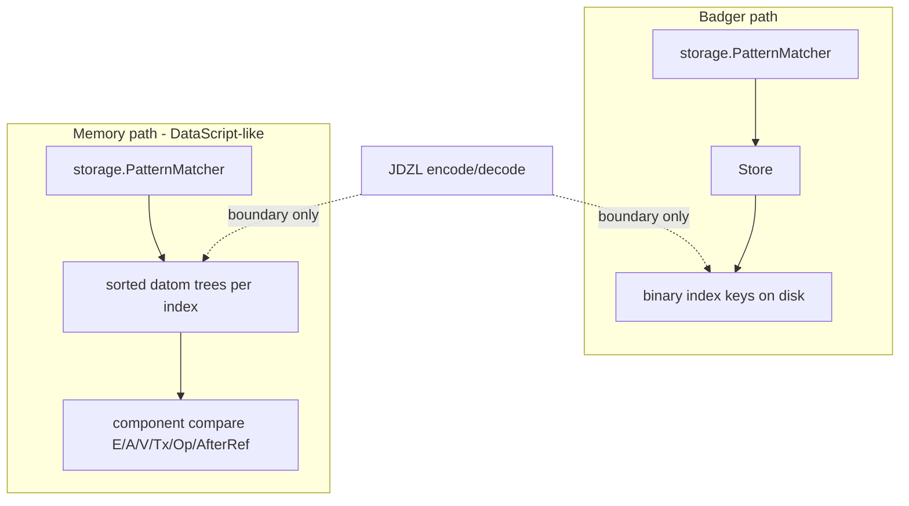

# Memory indexes: DataScript trees, not Badger keys in RAM

## Status

`MemoryTreeStore` is the typed representation this document argues for. It runs
the backend contract beside `MemoryStore` and Badger, and
[`MEMORY_BACKENDS_2026-07-31.md`](../perf/MEMORY_BACKENDS_2026-07-31.md)
measures the pair.

Two modes, not a swap: `MemoryTreeStore` is the js/wasm default, and
`MemoryStore` remains the Badger emulator. `PERFORMANCE_STATUS.md` carries the
cross-backend measurements the default moved on.

## Summary

Badger binary keys are the wrong live in-memory representation. Memory follows
DataScript: sorted trees of typed datoms per index order, with seek and slice by
component compare. Binary encoding stays at the Badger and JDZL boundaries only.
`storage.PatternMatcher` owns index selection against that abstraction; physical
scan forks by backend.

## Why binary keys are wrong in RAM

[`MemoryStore`](../../datalog/storage/memory_store.go) stores **the same binary
keys Badger writes to disk**, then adds a sorted `[]string` so prefix seek is not
O(N). Every assert, retract and scan pays `BinaryKeyEncoder` / `DatomFromKey` in
a process that has no disk and no Badger.

Encoding exists to make **byte order on disk** match index order. In RAM the
values are already typed — compare them directly.

Collapsing the map and its parallel key list into one ordered string-keyed map is
not the fix. It is the same wrong domain in one structure instead of two: the keys
are still encodings, and every operation still pays the round trip.

### The current baseline

`storage/memory_store.go`: `map[string][]byte` entries keyed by encoded index key
plus a `*btree.BTreeG[string]` of key strings for ordered seeks (`:36-59`);
`memoryStoreTx` journals prior values for rollback (`:301-373`);
`assertMemoryDatom` mirrors Badger's blob handling — blob entry then eight index
keys in one tx (`:435-447`); `MaxElementID` scans the TAEV prefix (`:165-175`).

That map holds three populations, not one: the eight index projections of each
datom, metadata under `metadataPrefix` (`:212-239`), and blob entries. Only the
first becomes trees; the other two need their own home, and the string prefix
currently hides them inside the structure being replaced.

`openDefaultStore` returns Badger on native (`default_store_native.go`) and
MemoryStore on js/wasm (`default_store_wasm.go`). **MemoryStore is the wasm
build's only backend**, so this project is the wasm engine's hot path and its
memory profile, and it is what the DataScript-shaped JS API work inherits.

## How DataScript does it

DataScript's DB is not a KV map of encoded keys. It is:

- A set of **datoms** (typed records)
- **Several sorted indexes** — historically EAVT / AEVT / AVET as persistent B+
  trees (`btset`), same datoms, different sort orders
- Lookups via **`datoms` / `seek-datoms` / `slice`**: build a from/to datom
  bound, walk the tree in index order
- Hot path: **component compare**, not serialize-then-`bytes.Compare`

The indexes *are* the store; there is no side table of "real" datoms behind
them. Range scans are the product.

### What does not transfer

**DataScript indexes hold current facts only.** A retraction removes the datom
from the sorted sets; `added` describes transaction data and the tx report, not a
tombstone retained in the index. History comes from holding old DB values or
replaying the tx log. Janus is append-only over a CRDT: its trees hold every
operation, and Tx-descending first-entry-wins ordering performs resolution work
DataScript's indexes never perform. That is why there are eight orders against
DataScript's three — the Tx-primary and Tx-descending orders exist to make
resolution a seek.

**The datom is larger.** DataScript's `tx` is an integer entity id and `added` a
boolean. Janus carries a 16-byte `ElementID`, a five-valued `Op`, and an optional
16-byte `AfterRef`, so the comparators have more components and a descending
direction on Tx.

What does transfer, beyond the representation principle: bound-datom slicing (a
partial datom with wildcard components as the low/high bound), transients for
bulk construction, and DB-as-value via persistent structure.



## The design

### Representation

For each of the eight index orders, a **persistent sorted tree of
`datalog.Datom`**, ordered by that index's component comparator.

- **Assert:** insert the datom into each index tree. Cost is pointer and struct
  sharing, not eight encoded key blobs.
- **Retract:** seek by component compare, remove matching datoms from all trees.
- **Scan:** seek the low bound, iterate while below the high bound — no
  `EncodeKey`, no `DatomFromKey`.
- **Blobs and large values:** keep values as Go values in the datom, or in a side
  content-addressed map keyed by hash **as a value store**, not as fake index
  keys. Tier 3 is a Badger packing concern.

What MemoryStore stops doing: the `map[string][]byte` of Badger keys, the sorted
parallel `keys []string`, and every hot-path round trip through
`BinaryKeyEncoder`.

### All eight orders, from one component-order table

All eight index orders become trees, and the comparator reads the component-order
table that already exists: `componentOrder(index)` in `scan_bound.go`,
which the scan-bound encoder already walks in `encodeBoundEndpoint`. The
comparator is a new reader of that table, not a new statement of the order.

Two other functions state the same orders independently, and PR B leaves both
alone. `encodeKeyWithParts` restates them as a switch; `DecodeKey` as offset
arithmetic derived from the order. Both belong to Badger and are hand-specialized
for their path — `DecodeKey` runs once per datom any scan materializes, through
`KeyOnlyIterator.Datom()` — and after the swap the memory backend holds typed
datoms and encodes or decodes nothing. Collapsing them onto the table is a
separate change that needs a benchmark rather than a tidiness argument; the
repository has already measured what that shape costs on this code
(`docs/archive/2025-12/KEY_ENCODER_CONSOLIDATION_BENCHMARKS.md`).

Why all eight rather than only those the matcher selects against memory:

1. Index ordering *is* the CRDT resolution. EATV/AETV first-entry-wins, ATEV's
   attribute high-water mark, and TAEV's descending clock recovery are
   definitions, not access-path optimizations. Dropping an order means losing a
   resolution path or re-implementing it by buffering.
2. Non-matcher consumers pin orders regardless of matcher selection: TAEV
   (`MaxElementID`, `DatomsAfter`), ATEV (the attribute high-water mark), EAVT
   (`MaxTxForEntity`, `ExportBinary`, the retract search prefix). ATEV is
   additionally pinned by `chooseIndex`'s A-bound plus Tx-bound arm.
3. Under shared typed datoms the marginal cost of an order is a pointer per
   datom rather than a full key copy.
4. A subset would make the two backends disagree about which access paths are
   efficient, forcing backend-conditional index selection into the planner.

Sharing the order table does not by itself make the comparator agree with the
encoder. The table fixes which components an index orders by and in what
sequence; how each component compares is separate code, and that is where
divergence hides. E, A and Tx each compare exactly: identities and keywords are
interned, so `Compare` short-circuits on the pointer and otherwise compares the
hash or the string, and over-length attributes are rejected at write and schema
time rather than truncated, so the fixed-width storage attribute and the keyword
are in bijection.

V does not, and cannot — see `BUG_V_PAYLOAD_NOT_PREFIX_FREE`. The payload
carries no length or terminator, so wherever a component follows V the byte
order of prefix-related payloads is decided by the following component's first
byte. The trees order by value; the keys do not.

### Comparators compare storage projections, not user-facing values

Binary key order is defined over the storage projections: E as the 20-byte
identity hash, A as the fixed 32-byte attribute form, V as
type-tag-then-sort-preserving-bytes, and Tx **descending** in the Tx↓ indexes.
An unintended disagreement between the typed comparator and binary order makes
Memory and Badger resolve the same datom set differently, so the differential
test — the same fixture ordered by `EncodeKey` bytes and by the comparator — is
the single most load-bearing deliverable in this project.

It cannot assert wholesale agreement, because one disagreement is structural
rather than a defect in the comparator: `BUG_V_PAYLOAD_NOT_PREFIX_FREE`. What
the test pins is agreement everywhere else, with the V-prefix pairs the one
named and understood exception — which is a weaker statement than the project
wants, and the reason that bug is a candidate to ride the
[TRANSACTION_ENVELOPES.md](TRANSACTION_ENVELOPES.md) break.

`Identity` is a bare interned 20-byte content address: in `datalog/identity.go`,
`identity` is `struct { value [20]byte }`, `NewIdentity` hashes the seed and
discards it, and `String()` returns `L85()`. That is exactly the storage
projection the comparators compare. Boundary *construction* — `NewIdentity`,
`#identity "L85"`, APIs that mint an Identity from a string at the edge — is
legitimate; comparison-time *coercion*, string-comparing an already-flowing value
across the type boundary, is not, and the E-position fallback that once did it is
now a loud panic in `storage/matcher.go` naming `validateEntityBinding` as the
upstream validator.

### Persistent trees; a database version is a value

Trees are persistent — structurally shared and immutable. Commit is a
root-pointer swap, a read session is a retained root, and a database version *is*
a root.

This is forced rather than preferred. `Store.NewReadSession` guarantees that
every read through a session observes one state regardless of writes committed
after it opened. Under mutable-plus-locks that admits exactly three
implementations: hold a read lock for the session's lifetime, which blocks
writers for arbitrary query durations and contradicts the concurrency `Database`
allows; copy at session open, which is O(N) per query; or fail to honor a
guarantee the interface documents. `MemoryStore` already reaches for a
copy-on-write clone of the key B-tree for this reason
(`read_session_memory.go`).

**One version value holds all eight roots, behind one `atomic.Pointer`.** Eight
independent pointer swaps are not one transition: a session opening mid-commit
would observe some orders updated and others not, and since index ordering is the
resolution, a torn cross-index state resolves the same datom set two different
ways.

Metadata sits outside it. It is a single key, `replica_id`, written and read only
at database open, so it never reaches a query path and
cannot participate in a torn snapshot — a plain field under the store's lock.

The blob map is in the version alongside them. Leaving it out would be safe only
by accident of a missing feature: `blob_store.go` has put and get and no delete,
and `DeleteDatoms` removes index keys only, so today nothing can free a blob a
retained root still references. Reclamation is the obvious thing to add on a heap
that never returns pages, and against an unversioned map it lets a collector free
a blob an open session's root still names. In the version it is reachability the
persistent structure already computes: drop a root, drop its map, and the blobs no
live root names become garbage.

Consequences beyond concurrency:

- The `memoryEntryUndo` journal is deleted rather than ported. Rollback is
  discarding a root.
- The vestigial per-scan key copy disappears. `memoryReadSession.scan` collects
  every key in range into a fresh `[][]byte` before returning its iterator, even
  though the clone already isolates the walk from concurrent writes. A cursor
  over a retained immutable root needs neither lock nor copy, which is also what
  the streaming invariant requires.
- Fixed-basis temporal reads become root retention rather than a per-read Tx
  comparison. This changes the cost profile of
  [TRANSACTION_ENVELOPES.md](TRANSACTION_ENVELOPES.md) PR 4 (transaction-closed
  AsOf), whose PR sequence does not yet account for it.
- Branching and snapshots ([BRANCHING_AND_SNAPSHOTS.md](BRANCHING_AND_SNAPSHOTS.md))
  become the same mechanism rather than a separate one.

Persistent trees pay path copying per insert. That resolves with the bulk-load
design rather than against it — a transient mutable builder that freezes into an
immutable tree, so import sorts and builds once instead of inserting per datom.

### The read seam

`StoreReader` is the read subset of `Store`, satisfied by both a `Store` (each
call opens its own storage transaction) and a `ReadSession` (every call observes
one snapshot). It speaks typed datom bounds: `Scan` and `ScanKeysOnly` take a
`ScanBound`, `Iterator.Seek` takes one, and `Encoder() *BinaryKeyEncoder` is not
on it. The encoder is a Badger concern, and its presence on a shared surface is
the mechanism by which a typed backend would be forced to secretly encode.

A `ScanBound` is an equality constraint on the leading components of an index's
order and nothing else. It names the datoms whose components equal the bound's
values.

There is no `Get`. A complete index key names one `(E, A, V, Tx)`, but Tx is what
CRDT resolution *determines*, so a reader that already knew it had nothing left to
ask. Every read is a scan; a bound binding all four components is the point
lookup, and returns at most one datom because Tx is unique per operation.

**The seam's contract is logical, and narrowing is the backend's obligation.**
This is the part a second backend must reproduce, and the part an implementer
will not infer from the type. A scan yields *exactly* the datoms whose bound
components equal the bound's values. For a backend that projects onto byte keys
that is not free: a V payload carries no length, so the keys for `"abcd"` sort
inside the range for `"abc"` interleaved with them, and no choice of endpoints
separates the two. What separates them is length — every component behind V is
fixed width and `Op` announces `AfterRef`, so a key carrying the bound's own value
has exactly one length per `Op` class. `EncodeScanBound` therefore returns an
`EncodedRun`: the byte range, plus a `runMembership` deciding which keys inside it
the bound names. `KeyOnlyIterator` and `memoryIterator` each hold the membership
and consult it from `Next`, `Key` and `Datom`.

**A tree-backed backend comparing typed components directly has no such gap and
needs no membership test** — which is why the obligation is stated as a contract
rather than left implicit in the byte encoder. A backend that returns everything
inside a range returns datoms the caller did not ask for, and no test above this
seam will say so.

### Physical scan forks by backend

| Backend | Physical seek |
|---------|----------------|
| Badger | binary prefixes over `Store.ScanKeysOnly` |
| Memory | datom-tree seek and slice by bound components |

`storage.PatternMatcher` depends on the narrow scan interface and owns planning,
rather than Memory declining to implement `Store`. The read seam is not the
defect; both backends satisfy it. The alternative changes which types implement
the interface without changing the interface's vocabulary, which was the defect —
and its real surface is much larger than matcher scans. Non-matcher `Store`
consumers that need memory-tree answers: the commit path (`BeginTx` /
`StoreTx.Assert` in `database.go`), EDN import (`Store.Assert` and
`MaxElementID` in `export.go`), JDZL import (`export_bin.go`), truncate
(`DatomsAfter` and `DeleteDatoms` in `truncate.go`), snapshots (`MaxTxForEntity`
in `snapshot.go`), clock restore (`MaxElementID` in `database.go`), replica-id
metadata (`GetMetadataUint64` / `SetMetadataUint64`), and the blob store. Keeping
the narrow scan interface leaves all of them behind the existing `Store` methods.

Names that coexist:

- `executor.PatternMatcher` — the interface
- `storage.PatternMatcher` — the Store- and tree-backed concrete matcher
- `executor.NewMemoryPatternMatcher` — an unrelated slice-plus-hash-index
  construct for multi-source tests; not `MemoryStore`

### Boundaries

- **`Store`** remains the Badger-shaped persistence API over binary keys. Memory
  is not obligated to fake it.
- **`Database`** opens either a Badger `Store` or memory datom indexes; matcher
  construction picks the scan backend.
- **JDZL and EDN export** walk memory's EAVT **datom** tree and encode at the
  writer; import decodes into tree inserts. Encoding is a serialization boundary,
  not the live representation.
- **Backend contract tests** assert parity of query and export semantics, not
  byte-identical internal keys between Memory and Badger.

## The tree

Neither reference implementation ports directly.
`me.tonsky.persistent-sorted-set`'s Java tree is shaped by JVM constraints —
fixed-length arrays, final-field safe publication, `SoftReference` — and its
ClojureScript sibling is a separate implementation whose branching factor is
*derived* from a path-packing scheme (`bits-per-level 5` ⟹ `max-len 32`) that a
Go cursor does not need. What follows is the Go-native shape, with each
divergence tied to the runtime property forcing it.

### Node

```go
// level 0 is a leaf. Nodes are immutable once published.
type node struct {
    level    int8
    keys     []*datalog.Datom // leaf: the datoms; branch: each child's maximum
    children []*node          // nil on leaves
}
```

One node type with a level discriminant — not an interface, not two types behind
one. Interface dispatch on descent sits inside the comparison loop and blocks
inlining; a level test is a predictable branch.

Divergences from the Java shape, each forced by Go:

- **No `_len` field.** Java arrays are fixed-length, so `ANode` carries `_len`
  beside `Key[] _keys`. A Go slice carries both — `len(keys)` is the count,
  `cap(keys)` the allocation — so the field and the class of bugs where the two
  disagree both disappear.
- **Explicit growth, not `append`.** `Settings.expandLen()` returns 8: arrays
  grow toward the branching factor in small steps. Go's `append` grows by roughly
  doubling, which overshoots badly at a large branching factor. Node growth
  allocates explicitly with a fixed step.
- **Slots past `len` must be cleared.** The GC scans a backing array's pointer
  slots to `cap`, so a stale `*Datom` above `len` keeps a dead datom reachable.
  Clearing on shrink is a retention requirement, not tidiness.
- **`atomic.Pointer` for the root.** The JVM gets safe publication of immutable
  nodes from final-field semantics. Go's memory model gives no equivalent
  guarantee for an ordinary store, so a reader could observe a partially
  initialized node. A release store on the root plus immutability after
  publication is what makes snapshot-by-retained-root sound rather than merely
  customary.

### Comparators

One tree implementation, taking a `cmp func(a, b *datalog.Datom) int`. The
comparator walks `componentOrder(index)` and compares components, reversing the
result for Tx in the Tx↓ orders.

That costs an indirect call per comparison during descent, and a per-component
switch inside it. Whether either matters is unmeasured: a seek at high branching
is roughly three to four levels of binary search, most comparisons resolving on
the first component because E differs. Specializing — eight concrete trees with
the comparison unrolled and inlined — is a local change afterward that reuses the
same table, touching the version struct, the sites indexing the trees, and
nothing above `storage`. It wants a profile first, and it costs wasm binary size,
which is the one target that ships its payload to a browser.

Generating the trees is not on the table for a different reason: the repository
has no generated code and no `go:generate`, and adding a generator to remove a
switch nobody has measured would be the
`docs/archive/2025-12/KEY_ENCODER_CONSOLIDATION_BENCHMARKS.md` experiment again
from the other direction.

### Branching factor

The reference implementations disagree: 512 on the JVM (minimum 256), 32 in
ClojureScript, the latter pinned by its path encoding rather than chosen. The
trade:

- High branching gives shallow trees — 3M items at ~350 per leaf is ~8,600 leaves
  under ~25 branches under a root, depth 3 — with per-node overhead amortized
  under a byte per datom and a negligible interior spine.
- Persistent insertion path-copies whole nodes, so a 512-wide node costs a 4 KiB
  copy per level touched. Per single insert that dominates, and argues for small
  nodes.

**Janus writes in batches.** A commit applies a transaction's datoms together and
import applies a chunk; with the transient builder below, a batch path-copies
once per *touched leaf* rather than once per datom, so the copy cost amortizes
over the batch and most of the argument for small nodes goes with it. High
branching is the indicated starting point.

**Start at 256.** At full packing that is depth 3 for three million datoms
(256³ = 16.7M). So is 512 (512³ = 134M), which reaches the same depth while
doubling the path copy per level to 4 KiB — the wider node buys nothing here. 256
is also the JVM implementation's stated minimum, so it sits inside a range known
to work. The value is empirical, not derived: it settles against the batch-size
distribution and against path-copy cost measured on a commit, not on a single
insert.

### Build modes

Both are batch-shaped:

- **Bulk build from sorted input** — the JDZL import path. Fill leaves to a chosen
  packing fraction, then construct branch levels bottom-up in one pass: no path
  copying, no per-insert comparisons beyond an order check. This is where the wasm
  hydration cost lives and it is what sets the store's resting memory, since
  packing fraction is a build property rather than a structural constant.
  [PRESORTED_INDEX_SECTIONS.md](PRESORTED_INDEX_SECTIONS.md) asks the next
  question: whether the sorted input can arrive off the wire instead of being
  sorted at all.
- **Transient batch apply** — a commit. The Clojure transient pattern translates
  directly: an owner token on the node, mutate in place when the token matches the
  active builder, copy otherwise. The token is discarded at publication, after
  which every reachable node is immutable again.

### The order-derivation lattice

The eight component orders are permutations of one component set, so a slice
sorted in one order is partially sorted for the others. `versionFromDatoms`
(`version_build.go`) exploits that: it sorts once and derives the rest, instead
of running eight independent `O(n log n)` sorts through the four-component
comparator. Three lemmas carry every derivation, and all three lean on the same
preconditions — the input is duplicate-free, the placement loops are stable, and
every comparator ends with the `[AfterRef?][Op]` tail the orders share.

**Deleting a component.** Stable-bucketing a sorted slice by any one component C
leaves each bucket holding its datoms in the source order with C deleted — C is
constant inside a bucket, so every comparison that consulted it falls through to
the components after it. Concatenating buckets in C's own order yields
`(C, source∖C)`. Bucketing EAVT by A gives `(A; E,V,Tx,tail)` = AEVT, and EATV
by A gives AETV — **zero datom comparisons**, one interned-pointer map lookup
per datom, and the bucket boundaries come out as per-attribute runs reused by
every later step.

**Resorting below a shared prefix.** Orders sharing a prefix differ only inside
that prefix's groups. EAVT and EATV share `(E, A)`, so the conversion resorts
each `(E, A)` group by `(Tx, V, tail)` — and an `(E, A)` group is one
attribute's history on one entity, which in entity-shaped data is one or two
datoms. AVET and ATEV resort the per-attribute runs by `(V, E, Tx, tail)` and
`(Tx, E, V, tail)`; A exists in the comparator's position but is never compared.

**Merging runs.** AVET's per-attribute runs are each V-sorted, and VAET is
`(V, A, ...)`— a k-way merge keyed `(V, run index)`, k = distinct attributes.
Run index is A's compare order, so V-ties order by A; a run's datoms enter the
heap one at a time, so within `(V, A)` the run's own `(E, Tx, tail)` order
survives untouched. `n log k` comparisons against `n log n`, on the most
expensive comparator family the build has.

| index | derived from | work | comparator |
|-------|--------------|------|------------|
| EAVT | input — presorted on a one-worker import | ~O(n) presorted pass; full sort otherwise | full order |
| EATV | EAVT, per-`(E,A)` group resort | ~O(n); groups mostly one datom | `(Tx, V, tail)` |
| AEVT | EAVT, stable bucket by A | O(n), **zero datom comparisons** | — |
| AETV | EATV, stable bucket by A | O(n), **zero datom comparisons** | — |
| AVET | per-A run resort | Σ nᵢ log nᵢ | `(V, E, Tx, tail)` — A never compared |
| ATEV | per-A run resort | Σ nᵢ log nᵢ | `(Tx, E, V, tail)` — Tx near-unique |
| VAET | k-way merge of AVET's runs | n log k, k = distinct attributes | V, then run index |
| TAEV | full sort | n log n, cheapest comparator | `(Tx, A, E, V, tail)` — rarely past Tx |

TAEV alone keeps a full sort, and it is the cheapest one available: Tx leads,
`ElementID` is two uint64s, and Lamports are near-unique, so comparisons rarely
read a second component. EAVT's own sort is pdqsort's presorted pass on the
import path — a one-worker JDZL import arrives in EAVT order — and a real sort
for any other empty-base batch, with every derivation downstream indifferent to
which it was.

The sequence runs over the gathered slice plus one n-pointer scratch — the
lattice's whole memory cost. `TestVersionFromDatomsMatchesDirectSorts` holds
each index pointer-identical to an independent direct sort of the same datoms,
on a fixture that collides E, A, V and Lamport and includes same-`(E,A,V,Tx)`
pairs distinguished only by the tail. Measured on the 62 MB / 2.7M-datom import:
**5.88 s → 2.89 s native, 27.7 s → 12.0 s js/wasm**, sort machinery from ~50%
to ~27% of import CPU, allocations unchanged but for the scratch slice.

[PRESORTED_INDEX_SECTIONS.md](PRESORTED_INDEX_SECTIONS.md) asks the question one
level up: whether some orders could arrive off the wire rather than being
derived at all. The lattice lowers what that would save — the two orders a wire
format could plausibly carry beyond EAVT are exactly the two the bucket pass
already derives without comparisons.

### Cursor

A path of `(node, index)` pairs. At high branching, depth is 3–4 for millions of
datoms, so the cursor holds a fixed-size array inline and allocates nothing per
step or per seek. The ClojureScript trick of packing the path into a single
integer at 5 bits per level exists to make paths cheap in JS and is what pins that
implementation to branching factor 32; Go needs neither the trick nor the
constraint.

The cursor is what typed bounds seek against: position at the low bound, iterate
while below the high bound.

### Datom allocation

The tree holds `*datalog.Datom`. Allocating those individually makes one heap
object per datom — 3M objects for a 3M-datom store. Slab allocation, `[]Datom` in
chunks with pointers handed out into the chunk, collapses that to a few hundred
objects while preserving ordinary Go pointers and GC correctness. Import
allocation cost falls with it, on the path where wasm's transient peak is
permanent.

This is distinct from the 32-bit handle representation: slabs keep pointer
semantics; handles leave them.

### What this tree does not need

Physical deletion is not a user operation — retraction is a CRDT `Remove` datom,
and `Store.DeleteDatoms` exists for truncate and rebuild only. The tree needs a
delete path but not a rebalancing one; truncate may rebuild affected trees from
the retained datoms. That removes the most intricate part of a B-tree
implementation from scope.

### Lazy subtree loading, later

`Branch` on the JVM holds `Address[] _addresses` beside `Object[] _children`,
where a child is a direct reference, a `SoftReference`/`WeakReference`, or `null`
pending restore from external storage. That is the capability the WASM
persistence adapters item in `TODO.md` describes: subtrees paged from OPFS or
IndexedDB instead of a whole-store hydrate. It belongs here because it is a
property of the branch node's shape — designing the branch without knowing where
the address slot would go makes it a rewrite later rather than a field.

Two things rule out the obvious translation:

- **`weak.Pointer[T]` is not the analog of `SoftReference`.**
  `persistent-sorted-set` defaults to `RefType.SOFT`, and a Java soft reference is
  cleared only under memory pressure — a cache with a GC-managed eviction policy.
  A Go weak pointer clears at the next collection once nothing strong points at
  the object. Translating soft to weak converts a cache into a guaranteed miss and
  produces reload thrash. Go has no soft reference; the analog is an explicit
  bounded cache of loaded nodes holding *strong* pointers, evicted by policy.
- **On wasm, release is the less valuable half.** Dropping a loaded subtree makes
  its memory reusable inside the Go heap; it does not return pages, because linear
  memory never shrinks. Eviction lowers the high-water mark only by keeping the
  peak from being reached at all, so the value is in demand loading against a
  bounded resident set — not in the ability to release after loading.

## Sizing

### The wasm linear-memory ceiling

A wasm deployment reached the 4 GiB linear-memory ceiling hydrating a production
dump into `MemoryStore`. The ceiling is architectural rather than a Go policy
choice: wasm32 addresses linear memory with 32-bit offsets — 65536 pages × 64 KiB
— and the runtime mirrors that as `heapAddrBits = 32` / `maxAlloc = 1<<32` without
adding a cap of its own. Exhaustion is `memory.grow` returning −1, `sbrk`
returning nil, and an unrecoverable `throw`.

The property that shapes the design is that **linear memory only grows**.
`sysFreeOS` cannot shrink a shared segment, so an instance is charged its
high-water mark for its lifetime. Peak, not retained, is the binding measure, and
every transient allocation on the import path is permanent for the session. That
makes bulk load a peak-memory decision, not only a wall-time one: sort-then-build
avoids repeated array doubling whose abandoned intermediates are charged forever.

**This is scheduling motivation, not the thesis.** The argument for typed trees is
representational — encoding exists to make byte order on disk match index order,
and in RAM the values are already typed — and it holds with or without a capacity
incident. A design of record propped on a capacity figure decays the moment the
artifact is regenerated.

### Representation arithmetic

**The per-datom figures below are a structural model with stated assumptions, not
a measurement.** The current side has an allocation measurement that bounds it
from above ([`docs/perf/memory_assert_bulk_2026-07-31.txt`](../perf/memory_assert_bulk_2026-07-31.txt));
neither side's retained figure is measured. See *Open*.

The `|V|` columns below are no longer guesses.
[`VALUE_DISTRIBUTION_2026-07-31.md`](../perf/VALUE_DISTRIBUTION_2026-07-31.md)
measures a production database at **23.7 encoded value bytes per datom**, which
lands on the `|V|`=24 column. Nothing in the table needed revising, and that is
the useful part: the projection was not fitted to the dataset it now agrees
with.

That measurement also shows what a per-datom average conceals. Two attributes
are 66.6% of the datoms; one of them carries 876,803 datoms across **five
distinct keyword values**, and its single most common value occurs 495,909
times. Keywords are already interned pointers, so those datoms cost the trees a
pointer each and cost a key-backed store the encoded bytes eight times over.
98.4% of values are of fixed-width or near-fixed-width types. The uniform
model therefore *understates* the typed representation on this shape, and the
figures below should be read as a floor rather than an estimate.

**Pointer width.** Go's js/wasm is a 64-bit-word target:
`cmd/internal/sys/arch.go` declares `ArchWasm{PtrSize: 8, RegSize: 8}`. Because
linear memory is capped at 2³², the upper four bytes of every pointer on wasm are
provably zero. A 32-bit arena handle is exactly as expressive there — and only
there.

**`Datom` layout** (72 bytes):

```text
E        *identity    off  0  size  8
A        *keyword     off  8  size  8
V        interface{}  off 16  size 16   (two pointers: type word, data word)
Tx       ElementID    off 32  size 16
Op       CRDTOp       off 48  size  1   (uint8)
         padding      off 49  size  7
AfterRef ElementID    off 56  size 16
```

Pointer content is 32 bytes (E, A, V); the non-pointer bulk is 40 (Tx, Op plus
padding, AfterRef). **The ElementIDs, not the values, are the non-pointer part** —
V's payload is already behind a pointer.

`Op`'s seven bytes are not a property of `uint8`: content is 65 bytes and the
largest field alignment is 8, so `Sizeof` rounds to 72 regardless of field order.
Moving `Op` last converts interior padding to trailing padding and saves nothing.
The padding is a symptom of shape: `Op` and `AfterRef` are a **sum type encoded as
a product**. `Op.HasAfterRef()` is the discriminant — three ops (none, add,
remove) are simple, two (rga-insert, rga-tombstone) carry a position — and
`AfterRef` is meaningless for every datom in a store without vectors.

**`Datom` stays at 72 bytes.** A nil-able pointer for the positional payload would
fold discriminant and payload into 8 bytes and fit the struct in one cache line,
but those eight bytes do not move the threshold — 153 B/datom against 145 at
|V|=8, 28.1M permitted datoms against 29.6M — while the pointer costs a
thirteenth traced slot on every datom where the GC note below counts twelve, an
allocation per RGA datom on the import path where wasm's peak is permanent, and a
second discriminant that must agree with `Op.HasAfterRef()`. `Datom` is a
`datalog/` value type; reference semantics for a storage-local win is not a trade
this project makes.

**Model at N = 3,000,000.** Estimated inputs, stated rather than measured: Go map
effective occupancy ~75%, `btree.BTreeG` node fill ~65% plus ~3% interior
amortization. The projected tree term assumes **high branching factor and a sorted
bulk build** — packing near full, per-node overhead and interior spine together
under 1% — which is the configuration the JDZL hydration path produces. Exact
inputs from code: eight index entries per datom, key length `71 + |V|`, map slot
headers 16 + 24, B-tree item 16, pointer 8.

Occupancy is a *build* property, not a structural constant, so the projected tree
term has a real spread. Random insertion converges on ~69% (ln 2); a sorted build
packs near full. Across the plausible configurations the eight slots cost roughly
67 B/datom (high branching, bulk-built) to 114 B/datom (low branching,
incrementally inserted). The table below uses **73**, near the bulk-built end
because that is what hydration produces; the resting memory of an incrementally
written store is correspondingly higher.

This is an order-of-magnitude projection, and what holds across the whole range is
the conclusion rather than the ratio: every configuration moves the store from
ceiling-bound to comfortably resident. The fill fraction is therefore not worth
pinning more precisely than that.

| | \|V\|=8 | \|V\|=24 |
|---|---|---|
| Current: 8 key backing arrays (size class) | 640 | 768 |
| Current: 8 map slots | 440 | 440 |
| Current: 8 B-tree items | 216 | 216 |
| **Current per datom** | **1,296 B** | **1,424 B** |
| Projected: `Datom` record | 72 | 72 |
| Projected: 8 tree slots | 73 | 73 |
| Projected: value payload | 8 | 24 |
| **Projected per datom** | **153 B** | **169 B** |
| **Projected at 3M** | **459 MB** | **507 MB** |

Roughly **8.5×** — which is an output of the arithmetic, not a target anyone
chose.

**The ratio is not the bar.** The bar is whether the store fits, with headroom,
under a ceiling that cannot shrink, and the useful form of that is a permitted
datom count:

| | B/datom | datoms before 4 GiB |
|---|---:|---:|
| Current | 1,296–1,424 | 3.0–3.3M |
| Projected, bulk-built | 153–169 | 25.4–28.1M |
| Projected, incrementally inserted at low branching | 194–210 | 20.5–22.1M |

At 2,708,364 datoms the current representation occupies **82–90% of the ceiling**
on a heap that never gives anything back, so the next few hundred thousand datoms
end it. Every projected configuration clears the bar identically; a 3× improvement
would clear it too. Treating 8.5× as a threshold would manufacture a way for this
project to "fail" while still solving the problem, and it would mislead in two
further ways: the ratio is N-dependent and says nothing about the growth
trajectory, whereas the permitted datom count is exactly what a capacity plan
needs.

The current side is insensitive to value size because **544 bytes per datom is
E + A + Tx re-serialized eight times** (`8 × (20+32+16)`), a fixed term that
dominates the key cost at any plausible `|V|`. And every figure here is *retained*
store, before GC headroom, working set, or import transients — the incident was a
hydration peak, so resting size clearing the bar is necessary and not sufficient.

**GC pressure.** Traced pointers per datom: 16 today (8 map string headers plus 8
B-tree string headers) against 12 projected (8 tree slots holding `*Datom`, plus
the datom's own E, A, and V's two words). Go's wasm collector is single-threaded,
so mark time scales with that count. Arena handles would make the eight slots
plain integers — 4 traced per datom — which is worth considerably more on wasm
than the four bytes per slot they save.

### Interning

`Identity`, `Keyword`, and `Symbol` are already interned pointer types whose
constructors (`NewIdentity`, `InternKeyword`, `InternKeywordFromBytes`,
`NewSymbol`) intern unconditionally. Extending interning to the remaining value
types is the same constructor-interns pattern applied to more types, not a new
mechanism and not new surface to close.

Three distinct axes, of which **only two are governed by duplication factor**:

- **Allocation.** `decodeBinaryChunk` boxes a fresh value per record, so a
  3M-datom import performs 3M value allocations. Interned, only distinct values
  allocate. This lands on the JDZL hydration path, where wasm's transient peak is
  permanent — the largest of the three effects and the one bearing directly on the
  ceiling.
- **Comparison.** Pillar 2 requires `ValuesEqual(a,b) ⟹ hash(a) == hash(b)`, so
  `hashValue` must hash *content*: O(len) on every hash-join build, probe, and
  `TupleKeyMap` insert. An interned value hashes by the precomputed id its interned
  object carries — `Identity.ID() uint64` is that mechanism, already built.
  Equality collapses from type-switch-plus-content-compare to a word compare.
  **This axis is independent of duplication:** a store of three million unique long
  strings saves no memory and still converts every probe from a content hash to a
  word load. Value size drives the comparison win *up*, not applicability down.
- **Memory.** The smallest of the three. At `|V|` = 8 the boxed payload is 8 of
  ~153 bytes.

Ordering is the one operation interning does not improve: an intern table cannot
assign order-preserving ids, so comparators dereference and compare typed
components. Pointer equality can short-circuit the compare, nothing more.

`Tx` is not an intern candidate despite heavy duplication. It is the descending
sort component in five of the eight orders, so interning buys 8 bytes and adds an
indirection to the hottest comparison in the engine.

**Table lifetime is a weak-reference question rather than a scoping one.** A
strong intern table is a permanent GC root: its entries are never collected, so on
a heap that never shrinks, dropping a database never releases its values. Keywords
and identities tolerate that because their populations are bounded — schema
attributes are few, and content-addressed identities are bounded by the dataset.
Arbitrary values are not bounded.

Scoping the table to the store approximates the fix. `weak.Pointer[T]` (Go 1.24;
the module floor is already `go 1.25`) supersedes it. A table of
`map[key]weak.Pointer[value]` retains nothing: a value lives exactly as long as
something strong points at it — a datom in a slab, held by a tree, held by a
database — and when the last such reference goes the entry clears, its map slot
reclaimed through `runtime.AddCleanup`. Dropping a database releases its slabs,
then its datoms, then its interned values, with no scope boundary to get right. It
also covers what scoping cannot: a value shared between two open databases, or one
still held by a query result that outlives its store.

Differentiated, not blanket. `Keyword` and `Identity` are bounded and effectively
permanently live, so weakness buys nothing there and costs a cleanup per entry.
Values are the unbounded, dataset-scale population, and they are the ones that
need it.

The costs belong with the decision, not underneath it: `Pointer.Value()` performs
a liveness check on every intern lookup, and one `AddCleanup` per distinct value
gives the collector work proportional to the distinct-value count. Against
store-scoped strong tables that is a trade to measure, not a free win.

## Plan

This project is the prerequisite for the implementation plan in
[TRANSACTION_ENVELOPES.md](TRANSACTION_ENVELOPES.md): the envelope work's typed
`TransactionRecord` trees reuse the tree-and-comparator machinery built here, and
its visibility PR threads through `storage.PatternMatcher`, so both land after
this project to avoid double churn. Envelopes remove 926,141 of 2,708,364 datoms
on the measured production shape (34.2%); this project changes the per-datom
representation for all of them. They compose, and the prerequisite ordering already recorded
there is also the larger-lever-first ordering.

One establishment per PR:

1. **PR 0 — hash-only Identity.** In the tree. Data-compatible; every tree and
   comparator built afterward inherits the canonical representation.
2. **PR A — rename and typed-bound seam.** In the tree. `BadgerMatcher` became
   `storage.PatternMatcher`, and `StoreReader`'s scan and seek surface speaks
   typed datom bounds with the Badger adapter encoding at its own boundary as the
   sole consumer. `Encoder()` left the store-agnostic interface in the same
   change. Query results are unchanged; the interface is not.
3. **PR B — the swap.** A per-index comparator reading `componentOrder`,
   differential ordering tests as its proof, persistent typed datom trees for all
   eight orders behind one versioned root that also carries the blob map, the
   memory scan adapter, JDZL/EDN boundary encode-at-writer, and semantic-parity
   backend contracts, as one unit — no subset leaves the memory
   backend coherent. The comparator lands with its consumer, not as an unconsumed
   PR of definitions. The `memoryEntryUndo` journal and the vestigial per-scan key
   copy are deleted rather than ported.

   Its whole interaction with the existing key machinery is additive: it adds a
   reader of `componentOrder` and changes nothing that exists.
   `encodeKeyWithParts` and `DecodeKey` are untouched. Outside its scope: the
   32-bit arena/handle representation, and any change to `datalog.Datom`.

### Settled before PR B starts

- **Bulk-build packing fraction.** An empirical parameter, not a derivation, and
  the one that sets the store's resting memory. Branching factor starts at 256;
  see *Branching factor*.

## Open

- **Retained size is still unmeasured.** `BenchmarkMemoryAssertBulk` bounds it
  from above — 5,005 B/datom allocated at N=1000, 18.7 allocations per datom
  ([`docs/perf/memory_assert_bulk_2026-07-31.txt`](../perf/memory_assert_bulk_2026-07-31.txt)) —
  which settles the direction the diagnostic was for: the store representation
  costs thousands of bytes per datom, so the 4 GiB is not going somewhere typed
  trees cannot reach. It does not confirm the 1,296 B/datom retained figure, which
  is what the 3.0–3.3M permitted-datom count rests on; `B/op` counts the undo
  journal, map rehashing and node splits alongside the store. A retained
  measurement wants a post-GC `HeapAlloc` delta across a known-N hydration.

  The allocation count is the part the sizing model does not predict at all, since
  it counts bytes only — and on a heap whose high-water mark never returns, 18.7
  allocations per datom bears on the hydration peak as directly as resting size
  does.

  The one figure available from outside — a post-GC `HeapAlloc` reading of a
  hydrated production dump — cannot cross-check the model, because that reading
  and the 2,708,364 datom count describe different regenerations of the same dump;
  the reading falls below even an exclusions-only floor for that count. Any sizing
  claim states its N, its host, and the dump commit.
- **Value interning** is undecided: which value types participate, and whether the
  table is weak (`weak.Pointer` plus `runtime.AddCleanup`, lifetime follows use) or
  strong and store-scoped. That trade wants measuring rather than asserting. It
  also couples to the handle ladder below: step 3 needs interning that hands out
  dense stable indices, a weak table clears entries when values die, and an arena
  holds its contents strongly. The two do not compose, and getting both requires
  generation-tagged handles — pack index and generation into 32 bits and distinct
  values cap at 16M, or keep 32 bits of index and the handle stops being
  self-validating. Deciding interning decides that too, whether or not anyone
  notices.
- **The 32-bit arena/handle representation** is a separate design, not a variation
  on typed trees: it leaves Go pointer semantics and GC tracking behind. Slab
  allocation of datoms is the pointer-preserving middle rather than the same
  decision. It is a three-step ladder. (1) **Slabs** — three million heap objects
  become a few hundred, killing the per-object half of mark cost while keeping
  pointer semantics; described under *Datom allocation*. (2) **Handles in tree
  slots** — the eight leaf words per datom stop being pointers, which requires an
  arena with stable dense indices; the datom itself is still scanned, four traced
  words each. (3) **A pointer-free `Datom`** — if E, A and V are handles too, the
  arena allocation is **noscan** and the collector skips the datom population
  entirely rather than scanning it faster. Step 3 holds both the real number and
  the real cost: `V` is `interface{}` above storage, so a handle-valued V makes the
  datom in the tree and the datom handed to the executor different types, with a
  materialization at the read boundary. That is tractable if the value arena stores
  the already-boxed interned object, but it is an interface to design, and it is
  where memory representation stops being local to `storage`.

  None of the three steps gates PR B. Nothing in the component-order table, the
  comparators, the differential tests or the scan semantics references allocation;
  the projected sizing column has no slab term; and a slab hands out
  `*datalog.Datom`, which is exactly what the tree already holds, so adopting slabs
  later changes the allocator and nothing else. Handles change the node struct itself,
  which is the asymmetry that makes them a separate design.
- [TRANSACTION_ENVELOPES.md](TRANSACTION_ENVELOPES.md) does not yet reflect the
  effect of persistent trees on its PR 4: transaction-closed AsOf becomes root
  retention rather than a per-read Tx comparison.
