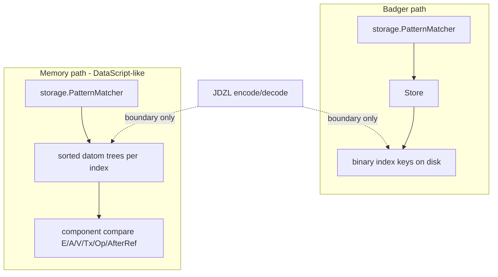

# Memory indexes: DataScript trees, not Badger keys in RAM

## Status

Proposal. Motivated by the wasm / injectable-`Store` work (`MemoryStore` today) and the realization that mirroring Badger’s binary key layout in process memory is the wrong representation for an in-memory engine.

## Summary

Reject Badger binary keys as the live in-memory representation. Memory follows DataScript: sorted trees of typed datoms per index order, with seek/slice by component compare. Binary encoding stays at the Badger and JDZL boundaries only. `storage.PatternMatcher` (renamed from `BadgerMatcher`) owns index selection against that abstraction; physical scan forks by backend.

## The mistake in the current MemoryStore

Today [`MemoryStore`](../../datalog/storage/memory_store.go) stores **the same binary keys Badger uses on disk**, then adds a sorted `[]string` so prefix seek is not O(N). Every assert/retract/scan pays `BinaryKeyEncoder` / `DatomFromKey` in a process that has no disk and no Badger.

That is backwards for an in-memory engine. Encoding exists to make **byte order on disk** match index order. In RAM you already have typed values — compare them directly.

## How DataScript does it

DataScript’s DB is not a KV map of encoded keys. It is:

- A set of **datoms** (typed records)
- **Several sorted indexes** — historically EAVT / AEVT / AVET as persistent B+ trees (`btset`), same datoms, different sort orders
- Lookups via **`datoms` / `seek-datoms` / `slice`**: build a from/to datom bound, walk the tree in index order
- Hot path: **component compare**, not serialize-then-`bytes.Compare`

Architecture notes (tonsky / datascript-tutorial): the indexes *are* the store; there is no side table of “real” datoms behind them. Range scans are the product.

Janus is richer than DataScript (CRDT Op/AfterRef, more index orders, ElementID Tx, History/AsOf), but the **representation principle** is the same: **trees of datoms, sorted by index comparator**.

## Target model for MemoryStore

**Primary representation:** for each index order Janus needs for matching (at least the ones `PatternMatcher` selects today — EAVT, EATV, AEVT, AETV, ATEV, AVET, VAET, TAEV as required), a **sorted tree (or sorted slice + binary search for v1) of `datalog.Datom`**, ordered by that index’s component comparator.

- **Assert:** insert the same datom into each index tree (DataScript does this; cost is pointer/struct sharing, not 8× encoded key blobs).
- **Retract:** seek EAVT (or E+A+V bound) by component compare, remove matching datoms from all trees.
- **Scan for the matcher:** seek low-bound datom → iterate while `<` high bound — **no `EncodeKey` / `DatomFromKey`**.
- **Blobs / large values:** keep values as Go values in the datom (or a side content-addressed blob map keyed by hash **as a value store**, not as fake index keys). Tier-3 is a Badger packing concern; memory can hold the bytes or the decoded value without pretending they are index keys.

**What we stop doing in MemoryStore:**

- `map[string][]byte` of Badger keys
- Sorted parallel `keys []string` of those encodings
- Hot-path round-trips through `BinaryKeyEncoder`

## PatternMatcher (rename + scan split)

Renaming `BadgerMatcher` → `storage.PatternMatcher` is correct: index *selection* is store-agnostic. The type already takes `Store` and serves Badger or Memory; the Badger prefix is leftover fiction.

What changes is the **physical scan**:

| Backend | Physical seek |
|---------|----------------|
| Badger | `Store.ScanKeysOnly` + binary prefixes (unchanged) |
| Memory | datom-tree seek/slice by bound components |

So either:

1. **`PatternMatcher` depends on a small scan interface** with two adapters (`binaryStoreScan` vs `datomTreeScan`), or
2. **Memory does not implement full `Store`**; `Database` wires Memory to a tree-backed scan used only by `PatternMatcher`, while Badger keeps `Store`.

Prefer (1) or a narrow “index cursor” API so one matcher owns planning. Do **not** keep implementing `Store` on Memory by secretly encoding keys — that recreates the bug.

Name coexistence:

- `executor.PatternMatcher` — the interface
- `storage.PatternMatcher` — the Store-/tree-backed concrete matcher
- `executor.NewMemoryPatternMatcher` — unrelated slice + hash-index helper for multi-source tests; do not conflate with `MemoryStore`

## Store / Database / JDZL boundaries

- **`Store`:** remains the Badger-shaped persistence API (binary keys). Memory is not obligated to fake it.
- **`Database`:** opens either Badger `Store` or Memory datom-indexes; matcher construction picks the scan backend.
- **JDZL / EDN export:** walk Memory’s EAVT **datom** tree and encode at the writer; import decodes into tree inserts. Encoding is a **serialization boundary**, not the live representation.
- **Backend contract tests:** parity of *query/export semantics*, not byte-identical internal keys between Memory and Badger.

## Comparators (Janus-specific)

Each index needs a total order on `datalog.Datom` matching today’s binary key order (so Badger and Memory agree on scan results):

- Identity / attribute / value / ElementID / Op / AfterRef as in `BinaryKeyEncoder` layouts
- Document that binary encoding and datom compare are two projections of the same order (tests: same sorted sequence for a fixture under both)

## What we are abandoning

- “Collapse map+keys into one ordered **string-key** map” — still the wrong domain (encoded keys).
- “MemoryStore mirrors Badger’s eight binary projections in RAM” as the long-term design.

## Implementation sketch (not scheduled here)

1. Define per-index datom comparators that match binary key order; lock with differential tests against `EncodeKey` sort order.
2. Replace MemoryStore’s KV map with datom trees (v1: sorted slices + binary search is acceptable).
3. Introduce a narrow scan/cursor abstraction; adapt Badger `Store` and Memory trees.
4. Rename `BadgerMatcher` → `storage.PatternMatcher` and wire scan backends.
5. Point JDZL Memory export/import at the EAVT datom tree.
6. Keep backend contracts on semantic parity; drop any expectation of shared internal key bytes.
