# Transaction Envelopes Without CRDT Datom Index Changes

**Status:** Proposal — design of record pending build
**Author:** wbrown (design direction), drafted with Claude through an adversarial multi-model review cycle
**Date:** 2026-07-17
**Builds on:**
- [../reference/CRDT.md](../reference/CRDT.md) — CRDT storage semantics
- [../reference/KEY_ENCODING_AND_CRDT.md](../reference/KEY_ENCODING_AND_CRDT.md) — keys-only index design
- [../reference/OP_POSITION_PROOF.md](../reference/OP_POSITION_PROOF.md) — unique-T and key-suffix proofs
- [../reference/INDEX_SELECTION_PROOF.md](../reference/INDEX_SELECTION_PROOF.md) — CRDT-correct index selection
- [SHARED_ARENA_DISTRIBUTION.md](SHARED_ARENA_DISTRIBUTION.md) — pinned bases, overlays, single-writer drain remapping
- [BRANCHING_AND_SNAPSHOTS.md](BRANCHING_AND_SNAPSHOTS.md) — frontier visibility and metadata-only merge
- [MEMORY_DATOM_INDEXES.md](MEMORY_DATOM_INDEXES.md) — typed-tree memory backend direction
- [CRDT_VECTOR_STORAGE_IMPLEMENTATION_PLAN.md](CRDT_VECTOR_STORAGE_IMPLEMENTATION_PLAN.md) — per-operation Lamport decision, SetTime removal

---

## Abstract

Preserve the settled per-operation ElementID and all eight CRDT index layouts.
Add one first-class transaction envelope per logical commit, containing a
globally unique transaction ID, wall-clock metadata, and the exact ordered
operation-ID membership needed for grouping and future replication.

Motivating shape: the Curse of Grimholt production database
(`curse_of_grimholt_full.jdzl`) — 2,708,364 datoms across 926,141 commits,
where `:db/txInstant` metadata datoms alone are 34.2% of all datoms and 90.4%
of all entities.

## Invariants that remain unchanged

The grouping feature must not alter the CRDT substrate established by
[`CRDT.md`](../reference/CRDT.md),
[`KEY_ENCODING_AND_CRDT.md`](../reference/KEY_ENCODING_AND_CRDT.md),
[`OP_POSITION_PROOF.md`](../reference/OP_POSITION_PROOF.md),
and
[`INDEX_SELECTION_PROOF.md`](../reference/INDEX_SELECTION_PROOF.md):

- Every datom keeps a unique 16-byte `ElementID{Lamport, ReplicaID}`.
- Every operation keeps its own distinct ElementID, and Add/Set/Remove ordering
  within one transaction is preserved.
- `Datom.Tx` remains the operation ElementID used by LWW, add-wins, RGA,
  History, AsOf, cache freshness, and unique-attribute resolution.
- All eight key layouts, `Tx↓` ordering, fixed component sizes, and the
  `[AfterRef?][Op]` suffix remain unchanged.
- RGA `AfterRef` continues to reference operation ElementIDs.
- Grouping metadata never participates in CRDT resolution.
- User transactions remain append-only: visible deletion is a CRDT `Remove`
  datom. Physical retraction is not a replayable distributed transaction
  operation.

## Primary representation

Add one append-only transaction envelope per successful logical commit:

```go
type TransactionID struct {
    ElementID datalog.ElementID
}

type TransactionMembership struct {
    Kind     MembershipKind      // contiguous (every current mode) or explicit
    First    datalog.ElementID
    Last     datalog.ElementID
    Count    uint32              // 0 = datom-less envelope (legal; no current producer)
    Explicit []datalog.ElementID // populated only when Kind == explicit
}

type TransactionRecord struct {
    ID          TransactionID
    Instant     time.Time
    ParentBasis SnapshotBasis // committed basis at sequencer entry (see below)
    Membership  TransactionMembership
    Digest      [32]byte      // canonical envelope digest
}

type TransactionEnvelope struct {
    Record TransactionRecord
    Datoms []datalog.Datom
}
```

The existing final `metadataElemID := clock.Next()` becomes the globally unique
transaction ID. Its full `(Lamport, ReplicaID)` value is used; the current
`tx:<lamport>` identity is not a valid distributed transaction identity because
it omits ReplicaID.

The record stores exactly one basis: `ParentBasis`, captured under the commit
sequencer immediately before authoritative ID assignment. Transaction
construction is not snapshot-isolated today — Set-diff reads observe committed
state at multiple points during construction — so the record does not claim an
"authored-against" snapshot that Janus never provided. `ParentBasis` is
monotone and a conservative upper bound on everything the transaction could
have observed, which is exactly what replication dependency checking needs.
The **inclusive** visibility basis used by `AsOf(ID)` is derived, never
stored: `ParentBasis` extended by the transaction's own committed range and
`ID`.

`Digest` is the SHA-256 of the canonical envelope encoding (parent basis,
instant, membership, ordered datoms). Keys-only storage cannot cheaply compare
"same content" on duplicate delivery; the digest makes idempotency a point
compare, and it is what the merge lineage check compares over shared history.

Membership is explicit in the contract and kind-tagged in the representation:
no consumer may assume an allocation convention, but every current commit mode
produces one contiguous authoritative range, and `MembershipKind` records that
fact instead of materializing million-element slices. Contiguous membership
stores only `[First..Last]` plus `Count` and derives the member list; the
explicit list is the semantic fallback for any future non-contiguous envelope.
`Count == 0` remains a legal datom-less encoding with no current producer. The
range doubles as the scalar visibility cut and an integrity check.

The envelope is the primary representation of transaction grouping. Datom
indices remain the primary representation of queryable CRDT state.

## Semantic change: commit-time authoritative IDs

This is the one deliberate semantic change, and it is deliberately **not**
listed under invariants: operation IDs used while a transaction is being
constructed are provisional. At commit, the owner's sequencer assigns one
contiguous authoritative range in publication order, remapping the
transaction's internal pending references (defined below). Within-transaction
operation order is unchanged. Across concurrently constructed local
transactions, CRDT resolution follows commit-publication order rather than
interleaved method-call order. Provisional IDs never persist and are never
valid external references.

Remap scope is structural, not a discipline. Pending intra-transaction
references — RGA AfterRefs and the transaction's own bookkeeping — carry a
distinct internal type rather than a raw ElementID:

```go
type PendingID uint32

type PendingRef struct {
    Committed *datalog.ElementID // reference to an already-committed operation
    Pending   *PendingID         // reference into this transaction's buffer
}
```

Only `Pending` references are remapped. Application-supplied ElementID
*values* (downstream's stored `:input/tx` bases are the live example) are
never rewritten — and by construction a caller can never hold a provisional
ID, because no API exposes per-operation IDs before commit: `Add`/`Set`/
`Remove` return no ID and `Commit` returns only the TransactionID.

## Commit path

At commit, the transaction owns the exact ordered pending datoms. The commit
sequencer assigns the contiguous authoritative ElementID range as above.
Construct the record from those final IDs and write it in the same storage
transaction:

```mermaid
flowchart LR
  Ops[Buffered datoms with provisional per-op IDs] --> Sequence[Per-replica commit sequencer]
  Sequence --> Remap[Assign authoritative range and remap local AfterRefs]
  Remap --> Record[Build membership, parent basis, and digest]
  Record --> StoreTx[Atomically persist datoms and transaction record]
  StoreTx --> Cache[Complete cache invalidation]
  Cache --> Publish[Advance published basis and publish envelope]
  Publish --> Return[Return TransactionID]
```



A failed commit persists neither the datoms nor the record and does not advance
the published basis. Commit finalization is sequenced per owner/replica so ID
range order and publication order agree. There is no coordination across AP
replicas; concurrent writers remain globally accept-and-append.

## Storage

Extend [`StoreTx`](../../datalog/storage/store.go) with
one atomic envelope-apply operation. Database commits, import, and replication
all use this boundary; no public database path may assert ungrouped datoms.
The Store API exposes typed transaction-log operations, not raw keys or values:

```go
type Store interface {
    // existing datom operations...
    Transaction(id TransactionID) (TransactionRecord, bool, error)
    TransactionsByID(from, to TransactionID, direction Direction) (TransactionIterator, error)
    TransactionsByInstant(from, to time.Time, direction Direction) (TransactionIterator, error)
    TransactionByOperation(id datalog.ElementID) (TransactionID, bool, error)
    TransactionByEntity(id datalog.Identity) (TransactionID, bool, error)
}

type StoreTx interface {
    ApplyEnvelope(TransactionEnvelope) error
    Commit() error
    Rollback() error
}
```

These transaction-log access paths are not CRDT datom indexes and are never
scanned for E/A/V resolution. Transaction membership is primary; instant,
operation, and transaction-entity orderings are mechanically derived.

Low-level index construction remains available inside storage backends, but
`Store.Assert` is not a public logical-write contract. The injectable Store
contract applies complete envelopes. Destructive index deletion remains an
internal maintenance primitive for truncate/rebuild, not a user transaction.

The record and all derived entries are immutable. Reapplying the same
TransactionID must compare equal logical content; different content under the
same ID is a corruption error, not last-writer-wins metadata.

### Badger: keys only

Badger continues storing empty values. A logical transaction record is
normalized into ordered key families:

```text
header:
  [TxHeader][TransactionID][TxEntity][Instant][BasisMode][Flags]
  [ScalarParentBasis][First][Last][Count][Digest]

per-replica range (operation-to-transaction):
  [TxRange][ReplicaID][FirstLamport][LastLamport][TransactionID]

frontier member (AP basis component):
  [TxBasis][TransactionID][ReplicaID][Lamport]

instant order:
  [TxInstant][SortableInstant][TransactionID]

transaction-entity lookup:
  [TxEntity][TransactionEntityIdentity][TransactionID]

non-contiguous membership (fallback encoding only):
  [TxMember][TransactionID][Ordinal][OperationID]
  [TxMemberByOperation][OperationID][TransactionID][Ordinal]
```

Every key has an empty Badger value. The header is the primary physical
transaction record; frontier keys extend its basis; instant and entity keys are
derived and rebuildable.

Contiguity does the heavy lifting. Every locally committed envelope's
membership is exactly `[First..Last]`, so:

- Forward membership enumerates the header range — no per-operation keys.
- Reverse operation-to-transaction lookup is a predecessor seek on the
  `TxRange` family, **scoped by the operation's ReplicaID**. An operation's
  ReplicaID always equals its transaction's ReplicaID, and one replica's
  ranges are contiguous, non-overlapping, and ordered. The *header* family
  alone cannot answer this lookup in a multi-replica store: it interleaves
  replicas in global `(Lamport, ReplicaID)` order, and `First` is not its sort
  prefix. `Last` is stored, not derived from the next range's `First` —
  failed commits burn sequencer IDs, so gaps between ranges are legal.

Per-operation `TxMember` / `TxMemberByOperation` keys are written only when a
header flag marks an envelope's membership as non-contiguous — a case no
current mode produces. A non-contiguous envelope writes **no** `TxRange`
entry: its span contains holes owned by other transactions, so range entries
would overlap. `TransactionByOperation` therefore seeks `TxRange` first and
falls back to a `TxMemberByOperation` point seek on miss. This mirrors the
JDZL encoding, which likewise stores the range and derives membership.
`SortableInstant` must be order-preserving for pre-1970 instants (a Go zero
time already round-trips as 1754 downstream).

Transaction order is the header prefix ordered by TransactionID. Instant order
is `(Instant, TransactionID)`. E-bound virtual-datom lookups are point seeks.

### Typed B-tree / MemoryStore

The typed-tree backend does not reproduce binary Badger keys. It stores one
typed `TransactionRecord` object in a tree keyed by TransactionID:

```text
recordsByID:      TransactionID -> *TransactionRecord
recordsByInstant: (Instant, TransactionID) -> *TransactionRecord
recordsByEntity:  TransactionEntityIdentity -> *TransactionRecord
recordsByRange:   (ReplicaID, FirstLamport) -> *TransactionRecord
```

Membership and frontier data live once inside the record. Secondary trees
reference that record; they do not copy its member list. `recordsByID` has the
same cross-replica interleaving as the Badger header family, so
operation-to-transaction lookup uses the per-replica `recordsByRange` tree —
the typed analog of `TxRange`; no per-operation tree is kept. This follows
[`MEMORY_DATOM_INDEXES.md`](MEMORY_DATOM_INDEXES.md):
typed sorted trees in memory, binary encoding only at Badger/JDZL boundaries.

The common Store contract is semantic (typed records and cursors), so replacing
Badger with a typed B-tree backend does not change Database, query, transaction,
or replication code.

### Atomic persistence

`StoreTx.ApplyEnvelope` performs, in one underlying backend transaction:

1. Encode the envelope's datoms into the unchanged eight indices.
2. Insert the primary transaction record representation.
3. Insert the per-replica range, instant, transaction-entity, and basis
   orderings required by that backend.
4. Commit all state together.

No transaction record can become visible without its datoms, and no datom can
become visible without its transaction record. Cache invalidation and published
basis advancement happen only after that storage commit succeeds.

Database open restores the Lamport clock from the maximum of:

- Maximum operation ElementID in TAEV.
- Maximum TransactionID in the transaction-record keyspace.

The second check is required because the final transaction marker no longer
exists as a normal TAEV datom.

## Ordering semantics

Transaction and instant ordering answer different questions:

- **Transaction order:** lexicographic `(Lamport, ReplicaID)` order of
  TransactionID. Under one writer this is commit order. Under multi-writer AP
  replication it is a deterministic total order for presentation and replay;
  it is not a claim that concurrent commits happened in that wall-clock order.
- **Causal order:** the transaction's authored basis/frontier plus its
  TransactionID. This becomes a partial order when distributed frontiers are
  introduced; it is not reconstructed from `Instant`.
- **Instant order:** `(Instant, TransactionID)`. This is audit/presentation
  order. Clock skew means it cannot drive CRDT resolution, AsOf visibility, or
  causal claims.

`Instant` is generated by the commit authority and stored in UTC. Remove
`NewTransactionAt` / `Transaction.SetTime`; caller-controlled business/event
time belongs in ordinary application attributes, as already decided in
[`CRDT_VECTOR_STORAGE_IMPLEMENTATION_PLAN.md`](CRDT_VECTOR_STORAGE_IMPLEMENTATION_PLAN.md).

## Transaction-closed AsOf

### Current defect

Current `AsOf(target)` resolves over:

```text
{ datom | datom.Tx <= target }
```

Because `Add`/`Set`/`Remove` allocate IDs before commit, concurrently open
transactions can interleave IDs. A transaction committed after `target` may
contain lower-ID operations and retroactively appear in that supposedly fixed
view. An arbitrary operation ID can also expose a proper prefix of its own
logical transaction.

The transaction-envelope design changes the public contract:

- `Commit()` returns `TransactionID`.
- `AsOf()` accepts a `TransactionID`, not an arbitrary operation ElementID.
- The transaction record resolves that ID to its committed `SnapshotBasis`.
- Every datom from a transaction is visible together or invisible together.
- Fixed AsOf handles remain immutable as later transactions commit or replicate.

### Basis representation

`SnapshotBasis` is designed now for both modes:

```go
type SnapshotBasis struct {
    Mode     BasisMode
    Scalar   datalog.ElementID      // embedded / single-writer CP
    Frontier map[uint64]uint64      // ReplicaID -> committed Lamport, AP
}
```

In embedded/single-writer mode, a committed transaction's operations occupy one
authoritative range ending before its TransactionID marker. Visibility remains
the current cheap scalar comparison.

In multi-writer AP mode, each replica independently sequences its own commits
and publishes a per-replica committed high-water. The transaction record stores
its `ParentBasis` frontier plus its own committed range. Visibility is:

```text
datom.Tx.Lamport <= basis.Frontier[datom.Tx.ReplicaID]
```

The envelope carries the frontier through replication. A receiver advances its
published frontier for that replica only after the complete envelope is
durable. TransactionID total order remains useful for deterministic
presentation; it is not substituted for the causal frontier.

### Central visibility predicate

Replace scattered raw `txID.Less(datom.Tx)` checks with one immutable
`Visibility` value threaded through every matcher and subscan:

```go
type Visibility struct {
    Mode     VisibilityMode
    Scalar   datalog.ElementID
    Frontier map[uint64]uint64
}

func (v Visibility) Includes(id datalog.ElementID) bool
```

Modes are latest-published, scalar committed basis, frontier basis, and
History. This is a semantic predicate, not a new storage/index strategy.

Every path must use it, including:

- CRDTResolvingIterator before group detection.
- EATV/AETV LWW reads.
- CardinalityMany `checkSetMembership`.
- `cardinalityManyAVETValueIterator`.
- Unique entity walks and AVET supersession subscans.
- RGA element and tombstone loading.
- V-bound candidate validation.
- Pull, PullMany, wildcard pull, and batch resolution.
- get-else/missing?/get-some and subqueries.
- Transaction-record projection.

The current two live cardinality-many leaks (`checkSetMembership` and
`cardinalityManyAVETValueIterator`) become mandatory regression tests, not
accepted baseline behavior.

### Latest, History, and cache

- **Latest (embedded/local):** remains unfiltered, exactly as today. The
  per-owner sequencer makes storage-commit order equal publication order, and
  envelope apply is atomic — every datom visible in storage belongs to a
  complete committed envelope. No per-datom basis check is added to the hot
  path.
- **Latest (distributed client):** pins the owner's published scalar/frontier
  at query start, per the arena read model.
- **Replication staging:** a received envelope whose `ParentBasis` is not yet
  satisfied stays in staging and never enters the live store. This is what
  lets local Latest stay unfiltered while envelopes may arrive out of order.
- **AsOf:** uses the immutable basis derived from the selected transaction
  record (`ParentBasis` + own range + ID). Whether that basis is *evaluated*
  per datom or *held* as a retained tree root is open under the prerequisite
  project's Ruling 2 — see the PR 4 amendment in the implementation plan.
- **History:** returns raw datoms from complete published envelopes and bypasses
  CRDT resolution, but never exposes a partially applied envelope.
- **Cache:** latest and each fixed AsOf basis have distinct cache state exactly
  as today. Cache freshness stamps use operation ElementIDs; basis identity
  determines which cache instance/view may reuse them.

### Snapshot and truncate

- `Snapshot(name)` commits an ordinary envelope whose datoms record the name;
  the envelope's own `ParentBasis` — captured under the sequencer — *is* the
  named state. Nothing calls uncoordinated `Store.MaxElementID()` as a
  semantic snapshot point.
- `AsOfSnapshot(name)` loads the snapshot envelope's record and reads at its
  `ParentBasis`, not its inclusive basis. The view therefore excludes the
  marker entity itself, an empty database yields a valid empty basis (no
  zero-ElementID/History sentinel collision), and merged/frontier states name
  themselves with no special case or referenced-transaction indirection.
- `TruncateTo()` operates on complete envelopes only and drains/blocks commits
  at the owner before changing retained state.
- Outstanding AsOf handles whose basis is no longer retained fail with a
  basis-not-retained error; they must not silently return a changed view or a
  stale private-cache result.
- `AsOf` errors distinguish basis-not-retained (locally truncated) from
  transaction-not-yet-known (a valid ID from a replica whose envelope has not
  arrived); callers rebuild for the former and may retry the latter.

## Canonical Datalog view

Transaction records remain in query space as a mechanically derived system
relation. The default database source projects each record as:

```clojure
[?tx :db/txID        ?transaction-id]
[?tx :db/txInstant   ?instant]
[?tx :db/txOperation ?operation-id] ; one fact per exact member
```

`?tx` is a deterministic Identity derived from the full TransactionID
`(Lamport, ReplicaID)`, not the current Lamport-only `tx:<n>` seed.
`:db/txID` and `:db/txOperation` values are ElementIDs.

The virtual facts have a defined fourth component: every fact projected from a
record carries `record-tx = TransactionID.ElementID`. These are immutable
system-relation members, not CRDT datoms, so sharing that Tx does not touch
the unique-T datom proofs — but the distinction is explicit. The matcher
declares `:db/txID` and `:db/txInstant` as cardinality one and
`:db/txOperation` as cardinality many.

The transaction record is the primary representation. These facts are created
at read time; they are not copied into all eight datom indexes. This follows
the existing `PatternMatcher` abstraction: add a transaction-record matcher
and compose it with the ordinary datom matcher behind the default `$` source.

The matcher must support:

- E-bound lookup of all properties for one transaction entity.
- A-bound scans of `:db/txID`, `:db/txInstant`, and `:db/txOperation`.
- V-bound lookup of an operation's transaction through a derived
  operation-to-TransactionID lookup key.
- Fully unbound scans for History/export/statistics parity.

Queries order transactions without leaving Datalog:

```clojure
;; Deterministic transaction order
[:find ?tx ?txid
 :where [?tx :db/txID ?txid]
 :order-by [[?txid :asc]]]

;; Wall-clock audit order, TransactionID breaks ties
[:find ?tx ?instant ?txid
 :where [?tx :db/txInstant ?instant]
        [?tx :db/txID ?txid]
 :order-by [[?instant :asc] [?txid :asc]]]

;; Group ordinary datoms by logical transaction
[:find ?txid ?operation ?e ?a ?v
 :where [?tx :db/txID ?txid]
        [?tx :db/txOperation ?operation]
        [?e ?a ?v ?operation]
 :order-by [[?txid :asc] [?operation :asc]]]
```

The transaction relation is immutable system data. CRDT resolution is not
applied to it; duplicate envelope delivery is removed by TransactionID before
projection.

Temporal modes apply to the relation itself: under `AsOf(T)` only records
within T's inclusive basis project; under History all applied records project;
under Latest all published records project.

## Distributed contract

The transaction envelope is also the replication unit:

- Every writer/replica creates a unique TransactionID from its Lamport clock
  and ReplicaID.
- The complete envelope crosses the replication boundary; receivers do not
  reconstruct membership from operation order.
- Applying one envelope to a receiving owner is atomic.
- Duplicate delivery is idempotent by TransactionID.
- Per-operation ElementIDs retain all CRDT convergence semantics.
- Commit-time remapping is the same mechanism
  [`SHARED_ARENA_DISTRIBUTION.md`](SHARED_ARENA_DISTRIBUTION.md)
  specifies for single-writer drain, and it is mandatory for every local
  commit; the remap updates envelope membership, RGA AfterRefs, and typed
  pending references together.
- Multi-writer AP mode retains locally assigned operation IDs and ships them
  unchanged.
- One transaction targets one owner, matching the existing distributed
  boundary; atomic multi-owner transactions remain out of scope.

The record already carries `ParentBasis`; widening it from scalar to frontier
is a versioned-record change, not a change to datom keys or grouping identity.
One open distributed-scaling risk to carry forward: frontier storage grows with
the observed replica count per record, and its compaction/delta strategy
belongs to the future distributed design, not this proposal.

## Merging independent databases

Merge is the offline form of AP replication: a database is its envelope set,
and merging B into A applies B's envelopes through the same boundary as any
other write.

Preconditions:

- **Disjoint ReplicaID sets for independent merge.** ReplicaID remains the one
  writer identity; this proposal does not add an origin/incarnation identity.
  Before applying envelopes, compare the ReplicaID sets:
  - Disjoint sets: independent merge is valid.
  - Shared ReplicaID with byte-identical overlapping envelopes: idempotent
    resync of the same lineage is valid.
  - Shared ReplicaID with any divergent envelope, or with disjoint ranges that
    cannot prove common full-history lineage: reject as ReplicaID reuse.
  Because histories are append-only and unpruned in this scope, identical
  overlap is the lineage proof — compared by envelope digest, not by re-reading
  datom sets; future GC/checkpoint lineage is a separate distributed-design
  problem. Downstream habitually opens databases with
  `WithReplicaID(1)`; independently mergeable databases must instead use
  distinct IDs (the random default already does).
- **Compatible schemas.** Schema is not part of the envelope; the caller owns
  schema agreement. Conflicting cardinality/type for one attribute makes merge
  semantically undefined.
- Both databases are envelope-format (hard break; no pre-envelope data
  participates).

Mechanics:

1. Enumerate B's envelopes (`TransactionsByID`; incremental resync uses
   `TransactionsAfter`).
2. `ApplyEnvelope` each into A — atomic per envelope, idempotent by
   TransactionID with digest equality.
3. Apply any envelope whose `ParentBasis` is satisfied, tie-breaking the ready
   set by TransactionID. For well-formed histories, TransactionID order *is* a
   topological order — observing a transaction raises the observer's clock
   past it; that is the defining Lamport property — so the dependency check is
   a defensive integrity guard (a malformed envelope surfaces as "dependency
   never satisfied" instead of being misapplied) and the mechanism that
   handles out-of-order streaming delivery. If envelopes remain and none are
   ready, report the missing dependency; do not guess.
4. A's clock does `Receive` past absorbed Lamports; A's published frontier
   gains a component for B's ReplicaID.
5. Return the combined `SnapshotBasis`. Merge is a frontier change, not a
   datom transaction: an automatic replicated marker envelope would ping-pong
   under bidirectional sync — each side absorbs the other's marker and mints a
   new one, growing both logs forever while fully quiesced. A durable named
   `AsOf` target for "A after absorbing B" is an explicit caller-invoked
   `Snapshot(name)` afterward, whose `ParentBasis` is exactly the combined
   frontier; whether to snapshot per sync is caller policy, never a system
   mandate.

Bidirectional merge converges: resolution is a pure function of the datom set
under the ElementID order, so both databases reach identical resolved state.

Data semantics:

- Entity identity is content-derived, so identity is global: different seeds
  union without interaction; a shared seed merges attribute-wise under normal
  CRDT rules (LWW / add-wins / RGA / unique `(A,V)`-LWW with fallback).
- Both full histories survive.
- Between independent clocks, the LWW winner is deterministic but semantically
  arbitrary — Lamport magnitude reflects write count, not wall-clock recency.
  "Newer dataset wins" is not a property merge provides.

AsOf across merge — the frontier provision:

- A pre-merge basis interpreted as a scalar would leak B's numerically lower
  Lamports into A's old views. Interpreted as the frontier `{A: n}`, the
  absent-replica-is-invisible rule keeps every pre-merge handle and stored
  TransactionID exactly closed over what it originally saw.
- Scalar mode is the degenerate single-replica frontier, so absorbing the first
  foreign envelope widens bases without rearchitecting.
- The merged transaction relation projects both record sets; `:db/txID` order
  stays deterministic and `TransactionsByInstant` interleaves the two audit
  timelines.

Merge does not provide: entity unification across different seeds (the
deferred upsert round — unique attributes yield one canonical owner for
lookups, not a merged entity), schema reconciliation, or cross-owner
atomicity.

## Public semantics

Typed APIs are conveniences over the same transaction-record relation:

```go
func (d *Database) Transaction(id TransactionID) (TransactionRecord, error)
func (d *Database) TransactionDatoms(id TransactionID) ([]datalog.Datom, error)

func (d *Database) TransactionsByID(
    from, to TransactionID,
    direction Direction,
) (TransactionIterator, error)

func (d *Database) TransactionsByInstant(
    from, to time.Time,
    direction Direction,
) (TransactionIterator, error)
```

The fourth Datalog pattern component remains the per-operation ElementID. Do
not silently change its CRDT/History meaning. Transaction membership joins that
operation ID through `:db/txOperation`.

Downstream migration: applications that persist operation ElementIDs as future
AsOf bases — narrative-generators stores `:input/tx` operation IDs on
`:task/input-deps` for prompt reconstruction — must persist TransactionIDs
going forward, or resolve a stored operation ID through
`TransactionByOperation` before calling `AsOf`. `AsOf` rejects raw operation
IDs.

`:db/txInstant` remains part of the public Datalog relation, backed by the
`Instant` property of the transaction record rather than an ordinary datom
replicated through all eight indices. New databases never physically write
`:db/txInstant` datoms.

## EDN, JDZL, and replication

- EDN export requires explicit transaction-record entries in addition to datom
  entries.
- JDZL bumps its format version, retains its EAVT/entity-aligned datom chunks,
  and requires a transaction-record section; no datom record or index ordering
  changes.
- Import is two-phase into a fresh, exclusively held database: all datom chunks
  first (parallel, entity-aligned as today), then all transaction records, then
  digest validation, then one import-complete marker. The database refuses
  queries and writes until the marker is present; a failed import is discarded,
  never repaired. A record is therefore never durable before its datoms, even
  though one transaction's datoms scatter across entity-aligned chunks.
- Digest validation is one streaming pass before the marker: scan TAEV (a
  forward scan yields descending operation IDs), buffer each transaction's
  operations — bounded by the largest transaction thanks to contiguous
  ranges — reverse into transaction order, merge-join against headers/ranges,
  recompute each canonical envelope digest, and verify every operation belongs
  to exactly one record. Any mismatch discards the target.
- Replication transmits `TransactionEnvelope` directly.
- Byte-stable export sorts transaction records by TransactionID and operation
  membership in recorded order.

Do not reorder JDZL into transaction-first datom chunks until compression,
parallel import, random-access, and CRDT-index implications are separately
measured and designed.

## Hard break: fresh databases only

Pre-envelope storage and export formats are unsupported. There is no migration,
inference, compatibility reader, or mixed database state.

- Introduce a physical storage-format version and reject Badger directories
  missing the envelope-aware version at open with a clear rebuild-required
  error.
- Bump JDZL and add an EDN format/version marker; reject files without the
  envelope-aware version and transaction records.
- Remove `:db/txInstant` emission and every test/doc that treats it as an
  ordinary stored datom; replace those tests with transaction-relation queries.
- Audit in-tree `Transaction.Retract` callers first (including the reflect
  `SaveStruct` replace path), then remove the public method; applications use
  schema-aware CRDT `Remove`. Keep physical deletion only for internal
  maintenance operations.
- Replace direct logical uses of `Store.Assert` with atomic envelope apply so a
  successfully opened current-format database cannot contain ungrouped datoms.
- Do not retain a legacy physical path for historical `:db/txInstant` facts.
- Do not infer membership from Lamport ranges or metadata markers.
- Downstream applications rebuild databases from their authoritative source
  material after upgrading.

## Rejected approaches

- Shared transaction Tx on datoms: violates unique-T and changes every CRDT
  ordering proof.
- TransactionID plus ordinal inside ElementID: changes fixed key components,
  cache/version comparisons, AsOf, RGA references, and distributed frontier
  assumptions.
- Contiguous Lamport ranges as the primary *logical* representation: grouping
  semantics must not depend on an allocation discipline. Physical encodings do
  exploit contiguity where the header flag records it, with explicit
  per-operation membership as the fallback.
- One membership datom per operation: multiplies each membership across all
  eight covering indices and nearly doubles datom count on the Grimholt shape.
- Deriving membership from `:db/txInstant`: exact information was never stored,
  and pre-envelope databases are rejected rather than repaired.

## Expected impact

### Database storage and write path

On the Grimholt shape:

- Current: 2,708,364 datoms, including 926,141 physical
  `:db/txInstant` datoms.
- Removing those metadata datoms eliminates 7,409,128 complete datom-index keys
  (926,141 × eight indexes).
- The Badger transaction log adds approximately 3,704,564 compact keys in
  scalar-basis mode: header, per-replica range, instant-order, and
  transaction-entity keys per transaction. Contiguous ranges eliminate
  per-operation membership keys for all 1,782,223 non-metadata datoms.
- Net key-count estimate: 3,704,564 fewer keys, a 17.1% reduction from the
  current 21,666,912 datom-index keys before Badger/LSM overhead.
- The removed txInstant keys represent about 558 MiB of raw repeated key
  components before Badger block compression. The added transaction-log key
  material is substantially smaller but is deliberately not estimated in bytes
  here — two successive drafts produced wrong byte figures, and exact sizes
  depend on final field encodings; the production rebuild benchmark is the
  number of record. The key *counts* above are exact. AP frontier entries add
  one compact key per `(TransactionID, ReplicaID)` basis component.

Commit metadata writes change from eight complete index writes per commit to a
constant four small transaction-log writes (plus AP frontier components when
distributed). Every transaction size writes fewer and smaller metadata keys
than today; the per-operation-key design's 2.5-operation break-even is
eliminated.

### Database behavior

Advantages:

- Exact logical transaction grouping becomes authoritative and atomic.
- Commit reports, audit views, replication, and retry/idempotency share one
  source of truth.
- Transaction identity includes both Lamport and ReplicaID.
- Transaction metadata no longer pollutes EAVT/EATV/AEVT/AETV/ATEV/AVET/VAET/
  TAEV resolution, cache freshness, schema inference, or physical entity count.
- CRDT resolution algorithms, index layouts, and first-entry performance remain
  unchanged.
- Future single-writer and multi-writer modes use the same envelope boundary.
- System commit time and application business time are no longer conflated.
- Commit-returned AsOf bases become transaction-closed and immutable under
  concurrent transaction construction and later replication.

Costs:

- Store implementations gain a separate transaction-log subsystem and atomic
  envelope-apply contract.
- Reverse operation-to-transaction lookup becomes a per-replica predecessor
  seek on the `TxRange` family / `recordsByRange` tree instead of a point seek
  — O(log N) either way on both backends, but the V-bound `:db/txOperation`
  join must be benchmarked against it.
- Non-contiguous envelopes (produced by no current mode) fall back to explicit
  per-operation membership keys.
- The default query source composes ordinary datoms with a virtual transaction
  relation, increasing matcher/planner surface.
- Fully unbound system scans expose approximately
  `2 × transaction count + operation count` virtual facts
  (`:db/txID`, `:db/txInstant`, `:db/txOperation`) instead of one physical
  txInstant fact per transaction. A-bound transaction queries remain direct.
- The hard break removes `SetTime`, `NewTransactionAt`, public physical
  `Transaction.Retract`, and ungrouped Store writes.
- Authoritative operation IDs are assigned at commit rather than API-call time.
  Within-transaction order is preserved; concurrently constructed local
  transactions resolve according to commit publication order rather than
  interleaved method-call order.
- Commit finalization is sequenced per owner/replica. Transaction construction
  remains concurrent, but durable publication throughput may change and must be
  benchmarked.
- Single-writer commit remapping must update every intra-transaction RGA
  AfterRef and typed pending reference before persistence; application-held
  ElementID values are never rewritten.
- `AsOf` accepts committed TransactionIDs/bases rather than arbitrary operation
  IDs; callers relying on operation-prefix snapshots must change.

### Temporal and distributed semantics

What this solves:

- Exact membership of every new logical transaction.
- Deterministic transaction ordering by `(Lamport, ReplicaID)`.
- Audit ordering by `(Instant, TransactionID)`.
- Atomic application and idempotent replication of one envelope at one owner.
- Transaction-closed AsOf in embedded/single-writer mode through authoritative
  contiguous commit ranges and scalar published bases.
- Transaction-closed causal AsOf in multi-writer mode through recorded
  per-replica frontiers.
- Snapshot capture at a published basis rather than an uncoordinated maximum
  operation ID.

What it deliberately does not solve:

- Multi-writer TransactionID order is deterministic, not a global wall-clock
  commit order.
- Instant order is not causal order.
- Atomic transactions spanning multiple owners remain out of scope.
- Retention of a basis after destructive truncate; callers receive
  basis-not-retained rather than an automatically reconstructed old view.

### JDZL and EDN

JDZL advantages:

- Removes 926,141 txInstant datom records from the EAVT body (about 73.3 MiB /
  76.9 MB uncompressed on the Grimholt shape).
- Adds exact grouping, transaction identity, instant indexing, and a natural
  replication envelope.
- Retains current entity-aligned datom chunks, LZJ behavior, deterministic
  EAVT ordering, and parallel datom import.
- Contiguous transaction records store only first/last/count; Lamport
  delta/varint encoding applies only to the explicit non-contiguous fallback.

JDZL tradeoffs:

- Membership duplication is limited to the non-contiguous fallback; contiguous
  records store only range and count.
- The format gains another indexed section and more import validation.
- The net 59.80 MiB production-file change cannot be predicted from raw bytes:
  current txInstant records compress well, and membership deltas may also
  compress well. Measure rather than claim a size win.
- The two-phase import order is what guarantees no record becomes durable
  before its datoms.

EDN advantages:

- Human-readable exports preserve exact transaction membership and audit time.
- Transaction records are explicit rather than inferred from marker datoms.

EDN tradeoffs:

- The format is no longer “one independent datom per line” only.
- Explicit operation membership can make EDN larger even though txInstant
  datom lines disappear.
- Import validation and deterministic rendering become more complex.

## Implementation audit items

- Replace `Store.DatomsAfter` consumers with envelope-based
  `TransactionsAfter`; `MaxTxForEntity` keeps operating on operation IDs.
- Update `cmd/datalog` stats/export/import and the datalog skill docs for the
  transaction relation and the versioned formats.
- Audit in-tree `Transaction.Retract` callers (including the reflect
  `SaveStruct` replace path) before removing the public method.
- Tier-3 blob writes join `ApplyEnvelope`'s atomic storage transaction.

## Verification

- Interleave operations from concurrent transactions and commit in both
  orders; each record returns exactly its own operations in call order and each
  Commit-returned AsOf basis excludes the other transaction until it commits.
- Verify sequential/quiescent LWW, add-wins, RGA, unique resolution, cache
  freshness, History, and AsOf results remain semantically unchanged.
- Verify authoritative-ID remapping preserves operation order within one
  transaction, including Add→Remove and repeated LWW writes.
- Add regression coverage for both current above-basis cardinality-many leaks:
  `checkSetMembership` and `cardinalityManyAVETValueIterator`.
- Verify AsOf across every cardinality, unique fallback/supersession subscan,
  Pull/PullMany/wildcard Pull, get-else/missing?/get-some, subqueries, and named
  immutable sources under scalar and frontier bases.
- Verify equal-Lamport/different-ReplicaID boundaries and AP causal frontiers.
- Verify export/import preserves transaction records and produces identical
  AsOf results at every retained TransactionID.
- Verify Snapshot under concurrent commits captures one published complete
  basis, never an in-flight range.
- Verify truncate removes only complete envelopes and every outstanding handle
  below the retained floor stays immutable while every removed basis returns
  basis-not-retained.
- Verify zero/empty database basis is distinct from History mode.
- Verify per-replica range lookup at boundaries: first/last operation of a
  range, the marker ID itself, IDs inside sequencer gaps from failed commits,
  and cross-replica interleaved ranges.
- Verify digest mismatch under one TransactionID is reported as corruption and
  applies nothing.
- Verify merge returns the combined `SnapshotBasis`, an explicit post-merge
  `Snapshot(name)` captures exactly that basis as its `ParentBasis`, and
  repeated bidirectional syncs of quiesced databases append no envelopes.
- Verify a `Count == 0` envelope remains a legal encoding that round-trips
  storage and JDZL.
- Verify `Snapshot` on an empty database yields a valid empty `ParentBasis`
  distinct from History, and `AsOfSnapshot` excludes the marker entity.
- Verify `TransactionByOperation` falls back from a `TxRange` miss to
  `TxMemberByOperation` for explicit-membership envelopes.
- Verify JDZL digest validation rejects a corrupted datom chunk, a missing
  operation, and an operation claimed by two records.
- Verify commit remapping never rewrites application-supplied ElementID
  values.
- Verify out-of-order envelope delivery stages until `ParentBasis` is
  satisfied and never surfaces in unfiltered local Latest.
- Verify instant-order keys sort correctly for pre-1970 instants.
- Verify basis-not-retained and transaction-not-yet-known are distinct errors.
- Verify merging two independent databases: bidirectional convergence to
  identical resolved state, idempotent re-merge, shared-seed entities resolving
  per CRDT rules, pre-merge AsOf bases excluding all absorbed foreign datoms,
  and same-ReplicaID divergent-lineage merges rejected via the digest lineage
  check.
- Verify record/datoms atomicity under every injected StoreTx failure point.
- Verify full `(Lamport, ReplicaID)` transaction identity across replicas.
- Verify duplicate envelope delivery is idempotent.
- Verify single-writer provisional-ID remapping updates membership and RGA
  AfterRefs together.
- Verify multi-writer replication preserves original operation IDs and exact
  groups.
- Verify EDN/JDZL round trips preserve records and deterministic output.
- Verify old database directories, EDN dumps, and JDZL files fail with the
  documented rebuild-required error.
- Benchmark commit sequencing, scalar AsOf, frontier AsOf, private AsOf-cache
  rebuilds, transaction lookup, live storage, and JDZL size using the Grimholt
  transaction-count/operation-count distribution.

## Implementation plan

*Appended 2026-07-18 after review of this design against the current codebase. Each PR must establish or change something on its own; no PR exists only to stage types or scaffolding for a later one.*

### Prerequisite project: typed memory datom indexes

[MEMORY_DATOM_INDEXES.md](MEMORY_DATOM_INDEXES.md) executes first, as a separate project, before any PR in this plan. The dependency is structural, not preferential: the typed B-tree / MemoryStore section of this proposal stores typed `TransactionRecord` trees (`recordsByID`, `recordsByInstant`, `recordsByEntity`, `recordsByRange`), but today's `MemoryStore` mirrors Badger's binary keys byte-for-byte. Landing envelopes against the current MemoryStore would build the transaction log twice — binary key families now, typed record trees after the memory rework. With the typed backend in place first, the flag-day PR builds the record trees once, in their final representation. The `BadgerMatcher` → `storage.PatternMatcher` rename and the scan-interface split from that proposal also land before PR 1 threads visibility through the same type, avoiding two rounds of churn in the most heavily-threaded type in the storage layer.

### Versioning policy

Compile-level API breaks may land within the current v0.x patch series. The storage/dump format break — PR 3 — is the minor version bump, and the tag immediately preceding it is the pin point for downstream applications until they rebuild from source material. The module version and the physical format marker are complementary, not redundant: the version signals the break at dependency-resolution time, the marker enforces it at open time with the documented rebuild-required error.

### PR sequence

**PR 1 — Central visibility predicate.** Format-independent correctness work that ships on its own merits. Establishes the `Visibility` value and threads `Visibility.Includes` through every site enumerated in the central-visibility section; changes behavior by fixing the two live cardinality-many AsOf leaks (`checkSetMembership`, `cardinalityManyAVETValueIterator`) with mandatory regression tests. The leaks exist precisely because the predicate is scattered — they are the two sites that never called `shouldFilterTx` — so centralizing the predicate closes the bug class structurally, not just the two instances. Scope constraint: PR 1 ships only the modes current semantics produce (latest, scalar committed basis, History). The frontier mode is added by PR 3 when a producer exists; shipping it earlier would be dead code committing to this design's shape before it is built.

**PR 2 — Append-only public write surface.** API-breaking, data-compatible: every pre-existing database opens and reads identically afterward. Removes `Transaction.Retract`, `Transaction.SetTime`, and `NewTransactionAt`; `DeleteSnapshot` moves to schema-aware CRDT `Remove` of the marker's registry attributes. The cascade retires `Transaction.retracts`, the commit-path `StoreTx.Retract` call, and `Store.Retract`, leaving `DeleteDatoms` (truncate's primitive) as the only physical-removal surface. Two semantic deltas are accepted and documented with tests: deleted snapshot markers remain visible to History and to AsOf views predating the deletion, and `TruncateTo` past a deletion envelope resurrects the snapshot — both are the temporally consistent behaviors; the current physical retraction retroactively falsifies history and is the anomaly. PRs 1 and 2 are mutually independent and may land in either order.

**PR 3 — Envelope flag day (the minor version bump).** Everything that must change together, in one PR: envelope/record/basis types and the canonical digest; the Badger transaction-log key families and the typed memory record trees; `StoreTx.ApplyEnvelope` and the Store transaction-log read methods; provisional IDs, `PendingRef`, the per-owner commit sequencer, and authoritative-range remapping; `Commit()` returning `TransactionID`; no physical `:db/txInstant`; clock restore from the maximum of TAEV and the transaction keyspace; tier-3 blob writes joining `ApplyEnvelope`'s storage transaction; the physical storage-format version marker; and rejection of pre-envelope Badger directories, EDN dumps, and JDZL files. Old-format rejection belongs in this PR, not the formats PR: the moment commits produce envelopes, importing a record-less dump would manufacture exactly the mixed state the hard break forbids. Bridge state until PR 4: `TransactionID.ElementID` remains valid as a scalar `AsOf` point, and commit-time contiguous ranges already close most of the current interleaving defect for local databases.

**PR 4 — Transaction-closed AsOf.** Changes the temporal contract: `AsOf` accepts a `TransactionID` and rejects raw operation IDs, resolving the basis through the transaction record; `Snapshot`/`AsOfSnapshot`/`TruncateTo` move to `ParentBasis` semantics; basis-not-retained and transaction-not-yet-known become distinct errors; `TransactionByOperation` provides the migration path for persisted operation-ID bases. First after the flag day because downstream migration is blocked on it.

*Amended 2026-07-25.* The prerequisite project ruled persistent trees ([MEMORY_DATOM_INDEXES.md](MEMORY_DATOM_INDEXES.md) Ruling 2): a database version *is* a root pointer, and a read session is a retained root. A fixed-basis temporal read can then be served by retaining the basis root rather than by evaluating `Visibility.Includes` per datom, which changes this PR's cost profile and its retention story — basis-not-retained becomes "that root is no longer reachable," a reachability fact, rather than truncation bookkeeping. The change is not uniform: Badger has no roots, so its fixed-basis reads remain predicate filtering, and a frontier basis names a per-replica high-water set that need not correspond to any root this replica ever held. **Open:** whether `Visibility` stays the single mechanism with root retention as a memory-backend implementation beneath it, or whether fixed-basis reads select between the two at the seam; and whether either answer moves work out of this PR. Ledger item 30.

**PR 5 — Transaction relation.** Establishes Datalog queryability of transactions: the composite matcher behind the default `$` source and the `:db/txID`/`:db/txInstant`/`:db/txOperation` projection with all four access patterns. Open decision: between PR 3 and PR 5, `[?tx :db/txInstant ?instant]` queries return nothing (instants are reachable only through the typed Go API). If that query-shape gap on main is unacceptable, PR 5 folds into PR 3 and the flag day grows.

**PR 6 — Envelope formats.** Establishes the versioned interchange formats: the EDN format marker and transaction-record entries, JDZL version 2 with the transaction-record section, two-phase import with streaming digest validation, imports routed through `ApplyEnvelope`, `cmd/datalog` and skill-doc updates, and regenerated example dumps. PR 3 rejects old dumps; this PR establishes the new ones — the interim is a brief capability gap with clear errors, not an incorrect state. Splitting EDN from JDZL would be pointless granularity; they are one establishment.

**PR 7 — Merge and replication surface.** `TransactionsAfter`, envelope-based merge with the ReplicaID lineage checks, and staging for envelopes whose `ParentBasis` is not yet satisfied. Depends only on PR 3 mechanically; last because nothing else depends on it.

The Verification items above distribute across the PRs where their machinery lands: the two leak regressions in PR 1; remapping, interleaving, and atomicity in PR 3; basis, retention, and snapshot semantics in PR 4; relation parity in PR 5; round-trip and digest validation in PR 6; merge convergence in PR 7. The Grimholt benchmark suite splits between PR 3 (write path, key counts) and PR 6 (JDZL size).

### Findings of record from the codebase review

- The reflect `SaveStruct` replace path does not call `Transaction.Retract`; it uses `tx.Remove()`/`Set`/`Add`, and `TransactionUpdater` does not expose `Retract`. The sole production caller is `DeleteSnapshot`; the remainder are five test files. The audit item above is satisfied with this result.
- Remove-based `DeleteSnapshot` is forced by this design, not merely preferred: marker datoms are members of a committed envelope, and physically deleting them mid-history breaks digest validation on import, the byte-identical-overlap lineage proof on merge, and basis honesty. The internal-maintenance carve-out for physical deletion applies only to whole-envelope tail operations (`TruncateTo`), never to mid-history members.
- Tier-3 blob writes already commit atomically inside the same Badger transaction as index keys, so that audit item reduces to keeping the existing behavior inside `ApplyEnvelope`.
- Today's temporal visibility already funnels through `shouldFilterTx` plus one inline compare in `CRDTResolvingIterator`, with exactly two sites skipping the check — the two named leaks. PR 1 is therefore mechanical threading plus two bug fixes, not a redesign.
